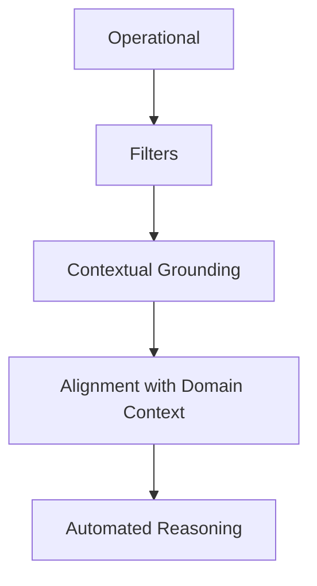
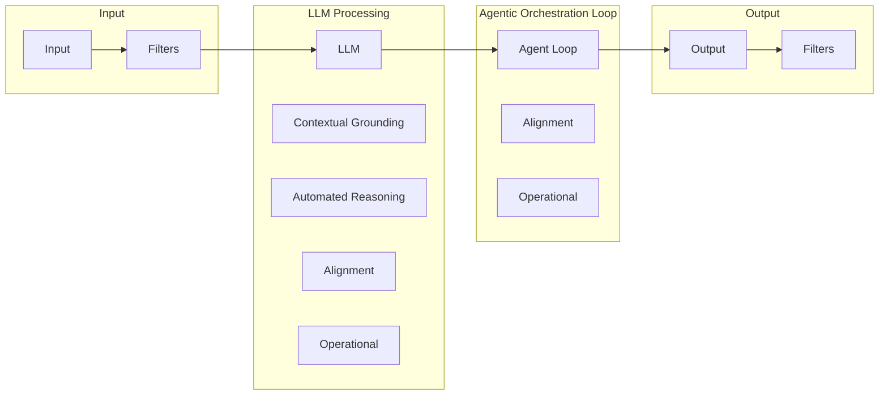

# Guardrails for LLMs and agents

This project shows how to use five types of guardrails for general GenAI applications and agents.

## Guardrail types

We will discuss five types of guardrails.

* Filters. These provide basic screening for trust and safety issues like malicious prompts, and also let you specify topics that the application shouldn't deal with.
* Contextual grounding. This helps prevent hallucinations.
* Alignment with domain context. This type helps with steering the behavior to align with business goals.
* Operational. This type includes rate limits, token limits, limits on the number of steps an agent can take, and other types of traditional security checks.
* Automated reasoning. This special type of filter helps the application adhere to formal policy guidelines.

## Where the guardrails are applied

Guardrails can be applied at the input (user prompt), output (final response), around the LLM directly, or in the agentic orchestration loop.

## Guardrails in the foundation model lifecycle

It's interesting to note that there are other types of guardrails that can be applied when a model is built. These include checks on pre-training data to reduce data bias and post-training alignment for safety. In this project we only deal with guardrails applied at runtime.

## Notebooks in this project

This project includes several Jupyter notebooks that demonstrate different types of guardrails:

* `04-02-01-filters.ipynb`: Demonstrates basic filtering techniques for trust and safety.
* `04-02-02-grounding.ipynb`: Shows how to use contextual grounding to prevent hallucinations.
* `04-02-03-alignment.ipynb`: Shows how to steer the agent towards desired behavior
* `04-02-04-operational.ipynb`: Examples of operational guardrails
* `04-02-05-reasoning.md`: Discusses automated reasoning

## Prerequisites

Install the python modules in `requirements.txt` using either `pip` directly or `uv`.
