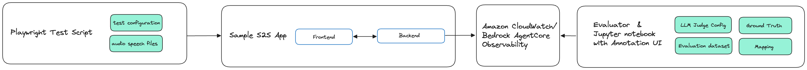
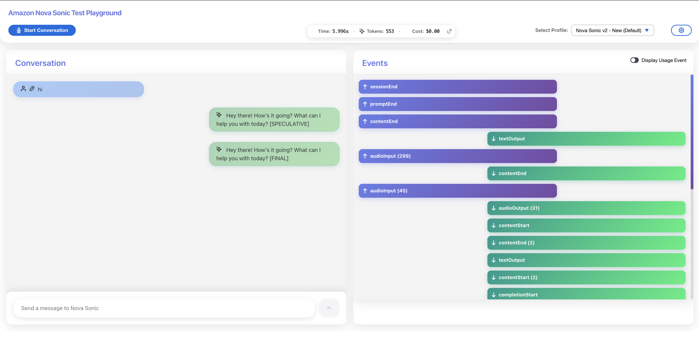
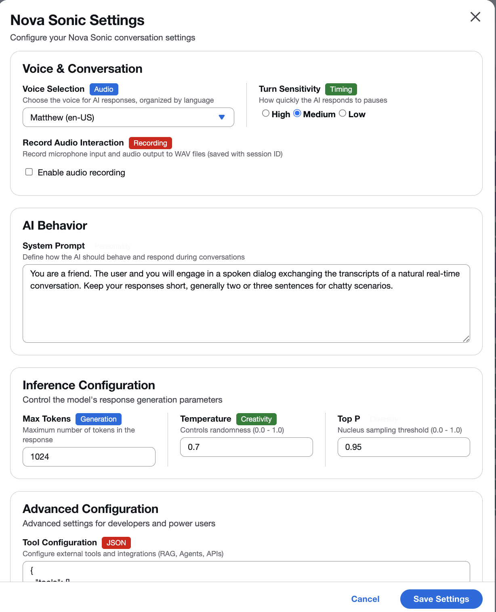
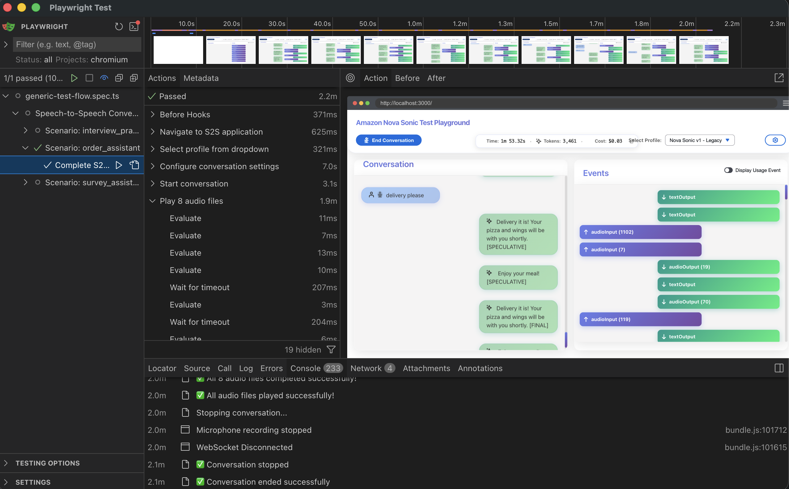
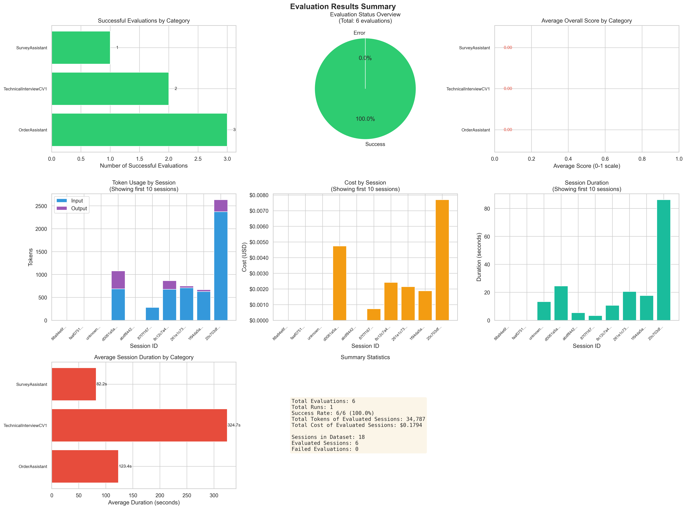

# Automated Nova Sonic Speech to Speech Evaluation

This project provides an end-to-end solution for evaluating Speech-to-Speech (Nova Sonic) interactions through automated testing and telemetry analysis with Amazon CloudWatch, Bedrock AgentCore Observability, and an LLM as a Judge evaluation approach.

## Architecture




## Project Components

1. **Test Suite** - Playwright E2E tests for automated S2S conversation testing with configurable scenarios
2. **Sample S2S App** - Full-stack reference application (React frontend + Python WebSocket backend) for testing
3. **Evaluation Pipeline** - LLM-as-a-Judge evaluation of conversation quality and tool call accuracy using CloudWatch telemetry











### Components

- **Test Suite** (`test/e2e/`) - Playwright tests for automated S2S conversation scenarios
- **Sample App** (`sample_s2s_app/`) - Reference implementation for testing
  - Frontend: React application with WebSocket audio handling
  - Backend: Python WebSocket server with Nova Sonic integration
- **Evaluation** (`llm_judge_text_eval_agent_core_observability.py`) - LLM-as-a-Judge evaluation using CloudWatch traces
- **Jupyter Notebook** (`s2s_entire_eval_pipeline.ipynb`) - Walks through the entire test and evaluation pipeline

## Technology Stack
- **Frontend:** React with TypeScript, Playwright
- **Backend:** Python 3.12, WebSocket (FastAPI/asyncio)
- **AWS:** BOTO3 SDK for CloudWatch, Nova Sonic API
- **Evaluation:** LLMs (Amazon Bedrock Model Access to Anthropic Claude Haiku 4.5)

## Test Scenarios Overview

The project includes three pre-configured test scenarios with audio files and validation data:

| Scenario | Description | Audio Files | Difficulty | Key Behaviors |
|----------|-------------|-------------|------------|---------------|
| **Interview Practice Assistant** | Technical interview preparation with STAR format evaluation | 5 files | Medium-High | STAR evaluation, follow-up questioning, context maintenance |
| **Pizza Order Assistant** | Restaurant ordering system for Stefano's Pizza Palace | 8 files | Easy-Medium | Menu navigation, order tracking, customization handling |
| **Customer Survey Assistant** | Voice-based satisfaction survey for Nova Sonic feedback | 7 files | Easy | Structured questioning, neutral acknowledgment, feedback collection |

Each scenario includes:
- Detailed README with purpose, expected flow, and success criteria
- Pre-recorded audio files for automated testing
- Configuration file with metadata and system prompts
- Validation dataset for LLM-as-a-Judge evaluation

See individual scenario folders in `test-data/` for complete documentation.

## Deployment Steps

### 1. After cloning the repository

```
cd s2s-evaluation
```

### 2. Create and activate a Python virtual environment:

```
python3 -m venv venv
source venv/bin/activate  # On Windows: venv\Scripts\activate
```

### 3. Install requirements

Before running the evaluation scripts, ensure you have the required Python packages installed:

```
pip install -r requirements.txt
```

### 4. Configure AWS Credentials

Copy the example environment file and configure your AWS credentials:

```bash
cp .env.example .env
```

Edit `.env` and ensure your AWS credentials are set. 

### 5. Run the sample S2S app 

**Terminal 1 - Backend:**
```bash
cp .env sample_s2s_app/python-server/.env
cd sample_s2s_app/python-server
./run_server_with_telemetry.sh
```

or with local logs:

```bash
./run_server_with_telemetry.sh 2>&1 | tee "telemetry_$(date +%Y%m%d_%H%M%S).log"
```

**Terminal 2 - Frontend:**
```bash
cd sample_s2s_app/react-client
npm install
npm run start
```

The app will be available at `http://localhost:3000` (or port shown in terminal)

#### Manual Testing (Optional)

Once both servers are running, you can manually test the S2S application:

1. Open `http://localhost:3000` in your browser
2. Click the **"Start Conversation"** button
3. Allow microphone access when prompted
4. Start speaking! Try these sample sentences:
   - "Hello, can you tell me about yourself?"
   - "I'd like to order a large pepperoni pizza for delivery"
   - "How's the weather in Seattle today?" (triggers async tool with 20-second delay)

The conversation will appear in the left panel, and WebSocket events will show in the right panel. Click "End Conversation" when finished.

### 6. Run automated tests

Run the Playwright E2E tests following the [detailed instructions here](test/e2e/README.md):

First install playwright.

```bash
npm install
```

Then run the automated tests.

```bash
npm run test:e2e:ui
```

or


```bash
npm run test:e2e
```


This will automatically:
- Start the test scenarios from `test-data/`
- Play audio files in numeric order
- Generate playwright test reports


### 7. Run Evaluation Pipeline

You can run evaluations in two ways:

#### Option A: Using Jupyter Notebook (Recommended)

The notebook provides an interactive, step-by-step evaluation pipeline with visualizations:

```bash
jupyter notebook s2s_entire_eval_pipeline.ipynb
```

The notebook:
- Starts the sample S2S app automatically
- Runs Playwright tests
- Extracts traces from Amazon CloudWatch
- Includes a **Manual Annotation UI** for mapping sessions to validation categories (required step)
- Runs LLM-as-a-Judge evaluations
- Generates comprehensive reports

#### Option B: Using Command Line

For automated/batch processing:

```bash
python s2s_evaluator.py --hours-back 24 --num-runs 3
```

**Note:** Command-line usage also requires mappings in `config/manual_mappings.json`. Use the Jupyter notebook's Annotation UI (Cell 21) to create these mappings first.

**Command-line options:**
- `--hours-back`: Hours to look back in CloudWatch (default: 24)
- `--num-runs`: Number of evaluation runs (default: 1)
- `--category`: Filter by category (e.g., "TechnicalInterview")
- `--session-ids`: Specific session IDs to evaluate
- `-v, --verbose`: Enable debug logging

## Evaluation Pipeline

### S2SEvaluator Class

The evaluation module provides a unified `S2SEvaluator` class for streamlined notebook and programmatic use.

**Example Usage:**

```python
import s2s_evaluator as eval_module

# Initialize with boto3 session (notebook usage)
evaluator = eval_module.S2SEvaluator(boto3_session=boto3_session)

# Extract traces from CloudWatch
traces = evaluator.extract_traces_from_cloudwatch(
    session_id=None,           # None = all sessions
    hours_back=24,
    log_group_name='aws/spans'
)

# Process into evaluation dataset
eval_data = evaluator.process_and_store_eval_dataset([traces], "data/s2s_eval_data.jsonl")

# Load configuration and validation data
config = evaluator.load_config("config/llm_judge_s2s_config.json")
validation_data = evaluator.load_validation_dataset("data/s2s_validation_dataset.jsonl")

# REQUIRED: Load manual mappings to connect sessions to validation categories
manual_mappings = evaluator.load_manual_mappings("config/manual_mappings.json")

# Initialize judge and run evaluation
judge = evaluator.initialize_judge()
results = evaluator.run_evaluation_iteration(
    category_filter=None,
    manual_mappings=manual_mappings  # Required parameter
)

# Generate report
merged = evaluator.merge_results([results])
report = evaluator.generate_evaluation_report(merged)
```

**Important:** Manual mappings are **required** to run evaluations. The validation dataset contains category templates (without sessionIds), and CloudWatch traces contain sessions (without categories). Manual mappings bridge the two by mapping `sessionId → category`.

### Evaluation Approach

The entire conversation flow throughout a session is evaluated. This includes:
- Tracking whether an agent successfully maintained context across multiple turns
- Correctly resolved anaphoric references
- Handled user corrections or topic shifts
- Appropriate tool usage and results

**Configuration Files:**
- LLM-as-a-Judge evaluation criteria: [`config/llm_judge_s2s_config.json`](./config/llm_judge_s2s_config.json)
- Validation dataset: [`data/s2s_validation_dataset.jsonl`](./data/s2s_validation_dataset.jsonl)
- Evaluation data (extracted from CloudWatch): [`data/s2s_eval_data.jsonl`](./data/s2s_eval_data.jsonl)
- Mapping file [`config/manual_mappings.json`](./config/manual_mappings.json)

### Pipeline Components

#### 1. Trace Extraction (`extract_traces_from_cloudwatch`)

Extracts OpenTelemetry spans from AWS CloudWatch Logs for a given time period:
- Defaults to last 24 hours if no time period specified
- Can extract specific session IDs or all sessions
- Returns structured trace data with session grouping

#### 2. Data Processing (`process_and_store_eval_dataset`)

Processes raw CloudWatch spans into a structured evaluation dataset:

- **Root Span Parsing**: Extracts metadata including `total_tokens`, `model.id`, `currency`, `output_tokens`, `cost`, and `session.id` from spans with `aws.span.kind: LOCAL_ROOT`
- **System Prompt**: Parses `input` value from `systemPrompt` spans
- **User Input**: Extracts `output.content` from `userInput` spans (concatenates consecutive spans)
- **Tool Usage**: Captures `input.toolName`, `tool_run_time`, `input.params`, `output.result` from `toolUse` spans
- **Assistant Output**: Parses `output.content` from `assistantOutput` spans (concatenates consecutive spans)
- **Filtering**: Ignores audio spans (`audioInput`, `audioOutput`) and session markers

#### 3. LLM-as-a-Judge Evaluation (`LLMJudge`)

Evaluates speech-to-speech sessions using Amazon Bedrock models:
- **Requires manual mappings** to match CloudWatch sessions (with sessionIds) to validation category templates (without sessionIds)
- Matching flow: `sessionId → [manual mapping] → category → validation template`
- Runs configurable evaluation criteria from config file
- Supports multiple evaluation runs for consistency testing

#### 4. Report Generation (`generate_evaluation_report`)

Creates comprehensive evaluation reports:
- Per-run JSON results in timestamped subdirectories
- Merged results across all runs
- Markdown report with scores, summaries, and conversation flows
- Token usage and cost tracking of speech-to-speech conversation flow

### Key Parameters (CLI)
- `--num-runs`: Number of evaluation runs to execute (default: 1)
- `--delay`: Delay between evaluation runs in seconds (default: 60)
- `--llm-judge-config`: LLM-as-a-Judge evaluation criteria (default: config/llm_judge_s2s_config.json)
- `--validation-dataset`: Path to validation dataset JSONL file (default: data/s2s_validation_dataset.jsonl)
- `--category`: Filter test cases by category (e.g., 'TechnicalSkills', 'PhoneScreening' - default is all categories)
- `--eval-dataset`: Path to eval dataset JSONL file (default: data/s2s_eval_data.jsonl)
- `--report_output_path`: Path to output the evalation results in markdown format and JSON (default: ./evaluation_results/)

**TBD 1: Automate matching to category / test case**

**TBD 2: Segment-Based Evaluation and two-tier scoring system**

Rather than just evaluating the entire conversation at once, an addition would be a moving window strategy. For example for a 5-turn conversation, evaluate [Turn 1→2], [Turn 1→3], [Turn 2→4], [Turn 3→5] as separate evaluation contexts. This prevents context overload and helps isolate where coherence or consistency breaks occur.​
Then we could implement a two-tier scoring system. Turn-level scores use Interaction Quality (IQ), where individual turns are rated on a 0-1 scale contributing to a running conversation quality score. 
Session-level scoring would enable turn scores and add weighted metrics like Task Completion Rate (TSR) or Turns-to-Success indicators.

### Manual Annotation UI

The Jupyter notebook includes an interactive annotation UI for creating session-to-category mappings. **This is a required step before running evaluations.**

**Features:**
- Session selector dropdown to browse evaluation data extracted from CloudWatch
- Turn-by-turn navigation with slider and prev/next buttons
- Side-by-side view of evaluation data and validation category examples
- Category assignment dropdown (TechnicalInterview, OrderAssistant, SurveyAssistant, Other, Unmapped)
- Persistent mapping storage in `config/manual_mappings.json`
- Visual feedback for existing mappings

**Why is this required?**

The evaluation pipeline requires manual mappings because:
1. **CloudWatch sessions** have `sessionId` but no test case / category information
2. **Validation dataset** has category templates but no sessionIds

**Manual mappings bridge the gap** by defining which sessionId corresponds to which validation category. Without these mappings, the evaluation cannot determine which validation template to use for each CloudWatch session.

**Usage:**
1. Extract traces from CloudWatch
2. Open the Manual Annotation UI
3. Review each session's conversation turns
4. Assign the appropriate validation category
5. Save the mappings to `config/manual_mappings.json`
6. Run the evaluation

### Evaluation Results

The evaluation pipeline generates two comprehensive report files:

1. **Markdown Report** (`evaluation_report.md`): Human-readable report with:
   - Summary statistics and average scores by criterion
   - Category/test case breakdown
   - Detailed conversation flows with turn-by-turn analysis

2. **JSON Results** (`complete_results.json`): Machine-readable format with:
   - Full evaluation results from all runs
   - Per-run metrics and scores
   - Detailed criterion scoring with explanations

**Sample Report:** [evaluation_report.md](test-evaluation-results/sample/evaluation_report.md)


## Authors

- Felix Huthmacher, Senior Applied AI Architect [github - fhuthmacher](https://github.com/fhuthmacher)


## License

[Apache License Version 2.0](/LICENSE)