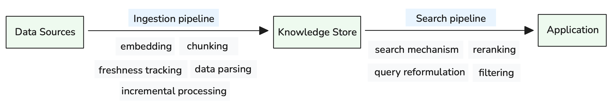

# Basic RAG System Evaluation

This project covers an abridged version of RAG evaluations to demonstrate how to evaluate the retrieval task of a RAG system as well as how to evaluate the entire system end-to-end.

A typical RAG system operates through two primary pipelines that transform raw organizational data into contextually accessible knowledge for GenAI applications:


Figure 1: RAG system Ingestion and Search Pipeline Architecture

The ingestion pipeline handles diverse data sources through specialized processing—embedding generation for semantic search, chunking for optimal retrieval granularity, freshness tracking for content currency, data parsing for multi-modal content, and incremental processing for efficient updates. 
The search pipeline serves AI applications through intelligent retrieval mechanisms—search algorithms that balance semantic and lexical matching, reranking for relevance optimization, query reformulation for better results, and filtering for access control and performance.

Each pipeline and component requires evaluation to ensure high performance.

## Table of Contents

- [Folder Structure](#folder-structure)
- [Getting Started](#getting-started)
- [Authors](#authors)


## Folder Structure

```
04-06-Basic-RAG/
├── data/                  # RAG context and validation datasets
├── example-notebook/      # Notebook for the evaluation
|__ images/                # Visualizations

```

### Details

- `data/`: Contains the datasets used for Retrieval-Augmented Generation (RAG) context and validation.
- `images/`: Contains images used in the Jupyter notebook and README.
- `example-notebook/`: Jupyter notebook demonstrating the evaluation of:
  - Embeddings & Chunking strategies
  - E2E RAG Testing

Given that this is an abridged version, we focus on how to evaluate the information retrieval task as well as how to validate the entire system end-to-end. For additional evaluations that cover embeddings, reranking, and LLM-As-A-Judge and RAG prompt engineering, please refer to the deep dive workshop covered in the [GenAI System Evaluation repository](https://github.com/aws-samples/genai-system-evaluation/tree/main).

## Getting Started

1. Set up a virtual environment:
   ```
   cd example-notebook
   python -m venv venv
   source venv/bin/activate  # On Windows, use `venv\Scripts\activate`
   ```

2. Install the required dependencies:
   ```
   pip install -r requirements.txt
   ```

3. Download opensearch docs for RAG context.
   ``` bash
   $ cd data && mkdir opensearch-docs
   $ git clone https://github.com/opensearch-project/documentation-website.git
   ```

4. Download a pre-created vector index.
   ``` bash
   $ cd data
   $ curl -o chroma.zip https://d3q8adh3y5sxpk.cloudfront.net/rageval/chroma.zip && unzip chroma.zip
   ```

5. Explore the example notebook in the `example-notebook/` directory to understand different evaluation techniques.

## Authors

- Felix Huthmacher  - *Initial work* - [github](https://github.com/fhuthmacher)