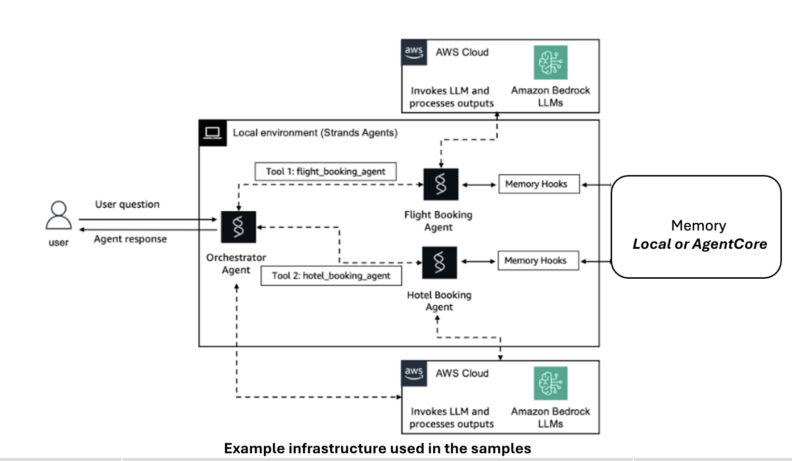

# Multi-Agent Shared-Context Evaluation Metrics

## 1. What Is Being Measured and Why

In a multi-agent system, the most important failures often occur *before* the final answer is produced. A sub-agent may receive stale context, a planner may update the budget but not the downstream hotel search, or two agents may work from different versions of the same itinerary. These are **memory and coordination failures**.

This sample focuses on those system behaviors. The objective is not only to know whether the final itinerary is good, but to know whether the agents collaborated with a **consistent shared reality**.

**The core evaluation question:**
> Did the agents operate on the same current facts and constraints, and did updates move through the system quickly and correctly?

## 2. Scope

Memory and coordination quality in multi-agent workflows, **independent of final answer accuracy**.

This is an example deployment pattern used in our samples. Agent systems are deployed locally.



## 3. Metrics

The metrics are architecture-neutral — they apply regardless of how agents are wired together. They split into three groups based on how they're computed.

### 3.1 Semantic Metrics (LLM-as-Judge, 1-5 scale)

Claude Opus scores each agent call after the conversation completes. Paraphrasing is handled — "Los Angeles" and "LA" are treated as the same.

| Metric | Scope | What it measures | Why it matters |
|--------|-------|-----------------|----------------|
| Context Freshness | Per agent call | Did the agent read the latest info from memory? | Stale reads mean updates aren't propagating |
| Handoff Completeness | Per agent call | Did the handoff carry all facts the agent needs? | Incomplete handoffs force the agent to guess |
| Context Utilization | Per agent call | Did the agent actually use what it read? | Writing to memory that no one uses is a silent failure |
| Memory Write Accuracy | Per agent call | Is what the agent wrote factually correct? | Prevents spreading wrong facts to downstream agents |
| Redundant Context | Per agent call | How much of the read context was repeated/irrelevant? | Over-sharing wastes tokens and attention |
| State Consistency | Per turn (cross-agent) | Do all agents in a turn agree on key facts? | Disagreement means agents are working from different realities |

### 3.2 Static Metrics (no LLM)

Pure math — cheap and deterministic.

| Metric | Scope | How it's computed | Why it matters |
|--------|-------|-------------------|----------------|
| Context Compression Ratio | Per agent call | `len(handoff) / len(original)` | Detects over-compression (losing facts) or under-compression (passing noise) |
| Memory Read Latency | Per agent call | `time.perf_counter()` around memory read | Direct coordination overhead |
| Memory Write Latency | Per agent call | `time.perf_counter()` around memory write | Direct coordination overhead |
| Coordination Latency % | Per agent call | `(read + write) / total agent time` | What fraction of time is coordination vs reasoning |
| Coordination Token % | Per agent call | `context tokens / total tokens` | What fraction of tokens is coordination vs generation |

### 3.3 Embedding Metrics (peer-to-peer only)

Used in Notebooks 3 and 4 where peer divergence matters.

| Metric | Scope | How it's computed | Why it matters |
|--------|-------|-------------------|----------------|
| C2 Alignment | Pairwise across peers | Cosine similarity of Bedrock Titan embeddings | Values near 1.0 = peers converged. Below 0.7 = significant divergence. |


## 4. Three Scenarios Evaluated

We evaluate these metrics across three orchestration patterns:

### Notebook 1 — Hub-and-Spoke with Local Memory (Travel Planning)

A coordinator delegates to three spokes (Flight, Hotel, Itinerary) via a shared **in-process Python list** that agents read from and append to. The hub LLM decides which spokes to call and what to pass to each.

Two sessions for comparison:

- **Session 1:** Fixed budget, no mid-session changes.
- **Session 2:** User changes budget mid-session.

### Notebook 2 — Hub-and-Spoke with AgentCore Memory (Travel Planning)

Same hub-and-spoke setup as Notebook 1, but the shared memory is backed by **AgentCore Short-Term Memory**. Agents read with `get_last_k_turns` and write with `create_event` against a managed memory resource. Use this when you need persistence, session isolation, or multi-process access.

Same two sessions as above so the metrics can be compared head-to-head against the local-memory version.

### Notebook 3 — Peer-to-Peer Dynamic Swarm (Market Research)

Three peer agents (Market Trends, Customer Insights, Strategy Synthesizer) collaborate through a **shared in-process Python list**. Each peer has `handoff_to_<agent>` tools and the LLM decides whether to hand off and to whom. A dispatcher loop starts with the first peer, reads which handoff (if any) was called, routes accordingly, and repeats until a peer responds without calling a handoff tool.

This is how real-world dynamic swarms work — peers can loop back, skip, or terminate early based on their own reasoning. Uses the same `ListMemoryHook` pattern as the hub-spoke notebooks because we don't control the invocation order.

Two sessions for comparison:

- **Session 1:** One research brief, one swarm run. Peers decide their own handoff path.
- **Session 2:** First run with baseline brief, then a second run where the scope expands (US → North America). Shared memory persists — tests whether peers choose different handoffs and reconcile stale analysis.

### Notebook 4 — Peer-to-Peer Sequential Pipeline (Market Research)

Same three peers as Notebook 3, but they run in a **fixed predetermined order** — each peer runs once, no peer decides who runs next.

This is the simplest peer pattern. Instrumentation is a plain for loop (no hooks needed because we control every step), and execution order is predictable. Good for understanding the peer-to-peer pattern before moving to the dynamic version.

Same two sessions as Notebook 3 for direct comparison between sequential and dynamic orchestration.

---

## Where to Start

Not sure which notebook to open first? Pick your path:

| If you want to... | Start with |
|-------------------|-----------|
| Understand the eval pattern with the simplest code | **Notebook 4** — sequential pipeline. No hooks, no cloud memory, just a for loop. |
| See a realistic coordinator-led multi-agent system | **Notebook 1** — hub-and-spoke with local memory. Real hub LLM picking which spoke to call. |
| Use it in production with persistent memory | **Notebook 2** — hub-and-spoke with AgentCore Memory. Same evaluation, cloud-backed memory. |
| Experiment with dynamic peer routing | **Notebook 3** — peers decide handoffs via tools. |

**Recommended learning order:** 4 → 1 → 3 → 2. Notebook 4 teaches the instrumentation without orchestration complexity. Notebook 1 adds a coordinator. Notebook 3 adds LLM-driven routing. Notebook 2 swaps the memory backend once the pattern is clear.

All four notebooks share the same `MetricsCollector`, produce the same reports, and use the same session structure (baseline + feedback). The orchestration pattern is the only thing that changes.

---

## 5. How This Sample Works

### 5.1 The Pieces at a Glance

```
┌─────────────────┐    ┌─────────────────┐    ┌─────────────────┐
│ Shared Memory   │───▶│ Agent runs with │───▶│ MetricsCollector│
│ (list or cloud) │    │ memory injected │    │ captures data   │
└─────────────────┘    └────────┬────────┘    └────────┬────────┘
        ▲                       │                       │
        │                       │                       ▼
        └───────────────────────┘              ┌─────────────────┐
           Agent appends response               │ LLM-as-Judge    │
           to memory after running              │ scores metrics  │
                                                │ after the run   │
                                                └─────────────────┘
```

Three things cooperate:

1. **Shared Memory** — where agents leave notes for each other. Either a Python list (simple) or AgentCore Memory (cloud-backed).
2. **The Agent Run** — each agent reads memory, does its work, writes back.
3. **The MetricsCollector** — an observation layer that watches everything and grades it afterwards.

### 5.2 Two Memory Backends (Hub-and-Spoke Only)

| Backend | Where it lives | Use when |
|---------|----------------|----------|
| **Python list** (Notebook 1) | In-process, in RAM | You're learning or iterating fast |
| **AgentCore Memory** (Notebook 2) | Managed AWS service | You need persistence, isolation, or multi-process access |

Both expose the same shape (read prior context, write this response), so the rest of the system doesn't care which is in use.

### 5.3 The Observation Layer: TurnRecord and AgentRecord

Memory stores what the agents **said**. That's not enough to evaluate them. To grade the system you also need to know what each agent **received** and **read**, how **long** it took, and how **many tokens** it cost.

We capture this alongside memory in two simple structures:

- **TurnRecord** — one per user message. Wraps everything that happened in response to that message.
- **AgentRecord** — one per agent invocation inside a turn. Holds the handoff, memory read, response, latencies, tokens, and (later) LLM judge scores.

```
Turn 1 ("Book trip LA→NYC, $1800...")
  ├── Agent call: flight     → handoff, context, response, latency, tokens
  ├── Agent call: hotel      → handoff, context, response, latency, tokens
  └── Agent call: itinerary  → handoff, context, response, latency, tokens
```

Why this layer exists: memory doesn't record the user's original message (it only has the compressed handoff), doesn't record what was *read* (only what was written), and doesn't have timings or token counts. TurnRecord fills those gaps so metrics have everything they need.

### 5.4 Orchestration Patterns — When a Hook Is Needed

All four notebooks capture the same data. The difference is **who controls the order of agent calls**:

| Notebook | Orchestrator | Order is… | How we instrument |
|----------|--------------|-----------|-------------------|
| 1 — Hub-Spoke (local) | Hub LLM | Unpredictable — LLM picks | `ListMemoryHook` on each spoke |
| 2 — Hub-Spoke (AgentCore) | Hub LLM | Unpredictable — LLM picks | AgentCore hook on each spoke |
| 3 — Dynamic Swarm | Peer LLMs via handoff tools | Unpredictable — peers pick | `ListMemoryHook` on each peer |
| 4 — Sequential Pipeline | Our for loop | Predictable — fixed order | Inline `record_*()` calls |

The rule: **if you control the order (a for loop), you don't need a hook.** Write reads/writes inline. If an LLM controls the order (hub or handoff tools), attach a hook that fires on Strands' `on_agent_initialized` and `on_message_added` events.

Whichever path you use, it calls the same `MetricsCollector` methods. The collector is orchestration-agnostic.

### 5.5 Metric Computation — Three Granularities

| Level | What's compared | Metrics |
|-------|-----------------|---------|
| **Per agent call** | One AgentRecord's handoff, context, response | Context Freshness, Handoff Completeness, Context Utilization, Write Accuracy, Redundancy |
| **Per turn** | All AgentRecords within one TurnRecord | State Consistency |
| **Per session** | All turns in one `MetricsCollector` | Reports (trace, context metrics, latency metrics, comparison) |

Each session is self-contained — the metrics surface problems on their own without needing a baseline to compare against.

### 5.6 Context Flow Trace

Every notebook can render a trace showing exactly what each agent saw and produced:

```
TURN 1 — flight
  📨 User: "Book a trip from LA to NYC, July 10-17, budget $1800..."
  📤 Handoff: "Find morning flights LA→NYC, July 10-17, budget $1800"
  📥 Memory read: (empty — first turn)
  💬 Response: "Delta DL123, 8:15am LAX→JFK, $650 round trip..."
  📝 Written to memory
```

This is how you spot where context broke, before the metrics even run.

## 6. How Data is Collected

Three instrumentation points per agent call, plus turn boundaries:

| # | Where | What | How |
|---|-------|------|-----|
| — | Before dispatching agents | Turn start | `collector.begin_turn(turn_number, user_message)` |
| 1 | `@tool` function / before peer call | Handoff query | `collector.record_handoff(agent_name, query)` |
| 2 | `on_agent_initialized` hook | Retrieved memory context | `collector.record_retrieved_context(agent_name, context)` |
| 3 | `on_message_added` hook | Agent response | `collector.record_response(agent_name, response)` |
| — | After all agents finish | Turn end | `collector.end_turn()` |

Latency timers wrap the memory read/write calls inside the hooks (list access for local-memory notebooks, `get_last_k_turns` / `create_event` for the AgentCore notebook). Token usage comes from the Strands Agent response object. The AgentCore hook uses `finally` blocks for metrics recording so it's never skipped even if memory operations fail.

## File Structure

```
metrics/
├── README.md
├── requirements.txt
├── model_config.py                         ← Centralised model IDs and prompts
├── metrics_collector.py                    ← LLM judge + latency tracking + reports
├── eval_helpers.py                         ← Shared functions (format_memory, embeddings, etc.)
├── 01-hub-spoke-local-memory.ipynb         ← Hub-and-spoke, Python list memory
├── 02-hub-spoke-agentcore-memory.ipynb     ← Hub-and-spoke, AgentCore Memory
├── 03-peer-to-peer-dynamic-swarm.ipynb     ← Peer-to-peer, dynamic handoffs via tools
└── 04-peer-to-peer-sequential.ipynb        ← Peer-to-peer, fixed sequential order
```

## Prerequisites

- Python 3.10+
- AWS credentials with access to Bedrock models (required for all notebooks) and AgentCore Memory (required for Notebook 2 only)
- Dependencies: `pip install -r requirements.txt`
