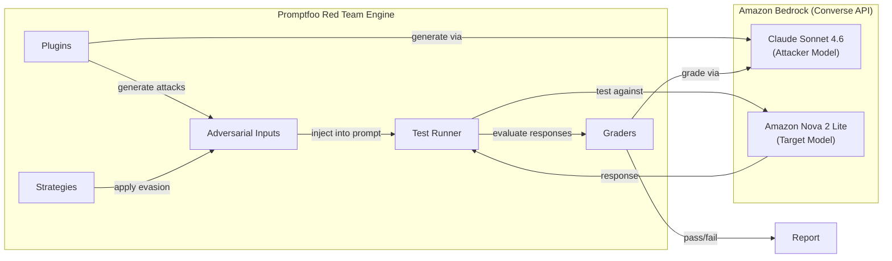
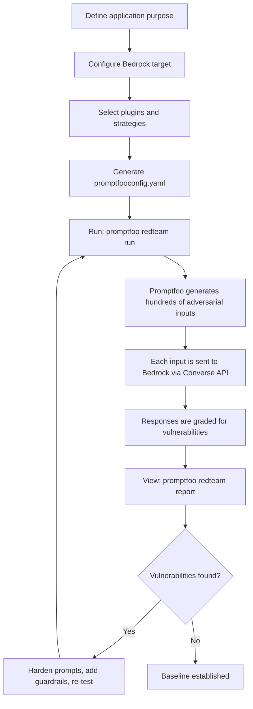

# Red Teaming a Bedrock-Powered LLM Application

This submodule walks through red teaming a basic LLM application that calls [Amazon Bedrock](https://aws.amazon.com/bedrock/) foundation models via the [Converse API](https://docs.aws.amazon.com/bedrock/latest/userguide/conversation-inference-call.html). You will configure [Promptfoo](https://www.promptfoo.dev/) to target a Bedrock model, generate adversarial test cases, and interpret the results.

## Key Concepts

### The Amazon Bedrock Converse API

The Converse API is a unified, model-agnostic interface for invoking foundation models on Amazon Bedrock. Instead of formatting prompts differently for each model family (Anthropic, Meta, Amazon, etc.), the Converse API standardizes the request into a common structure — a `messages` array with role-based turns, a `system` prompt, and a shared `inferenceConfig` for parameters like `temperature` and `maxTokens`.

This matters for red teaming because it means Promptfoo can target any Bedrock model through a single provider configuration. Switching the model under test is a one-line change in the config file rather than a rewrite of the prompt format.

### How Promptfoo Connects to Amazon Bedrock

Promptfoo supports Amazon Bedrock as a native provider. In `promptfooconfig.yaml`, you specify a Bedrock model using the provider ID format:

- `bedrock:converse:<model-id>` — uses the Converse API (recommended)
- `bedrock:<model-id>` — uses the legacy InvokeModel API

For example:

```yaml
targets:
  - id: bedrock:converse:global.amazon.nova-2-lite-v1:0
    label: 'nova-2-lite'
    config:
      maxTokens: 4096
      reasoningConfig:
        type: enabled
        maxReasoningEffort: medium
```

Promptfoo authenticates using your existing AWS credential chain (environment variables, `~/.aws/credentials`, IAM roles, or SSO profiles) — no separate API keys are needed.

### Red Teaming Architecture

The following diagram shows how the components fit together when red teaming a Bedrock-powered LLM application:



1. **Plugins** create adversarial inputs targeting specific vulnerability types (e.g., prompt injection, PII extraction, harmful content requests).
2. **Strategies** transform those inputs using evasion techniques (encoding, jailbreak patterns, multi-turn dialogue) to test whether defenses can be bypassed.
3. The **Test Runner** injects the adversarial input into your prompt template and sends it to the Bedrock Converse API.
4. The foundation model returns a response, which **Graders** evaluate to determine whether the attack succeeded.
5. Results are compiled into an interactive **Report** with vulnerability categories, severity levels, and suggested mitigations.

### The Attacker Model vs. the Target Model

Promptfoo's red teaming pipeline uses two distinct models:

| Role | What It Does | Model in This Module |
|------|-------------|---------|
| **Attacker model** | Generates adversarial inputs and evaluates results | Claude Sonnet 4.6 on Amazon Bedrock (`bedrock:converse:global.anthropic.claude-sonnet-4-6`) |
| **Target model** | The Bedrock foundation model you are testing | Amazon Nova 2 Lite on Amazon Bedrock (`bedrock:converse:global.amazon.nova-2-lite-v1:0`) |

Both models run on Amazon Bedrock, but they serve very different roles. The attacker model is intentionally separate so it can generate creative, unconstrained adversarial prompts — something the target model's safety training is designed to resist. This separation is what makes automated red teaming effective: you are testing the target's defenses against a purpose-built adversary.

### The Red Teaming Workflow



The key steps are:

1. **Describe your application's purpose** — this tells Promptfoo what the system is supposed to do, so it can generate contextually relevant attacks (e.g., a travel booking assistant gets different probes than a code review tool).
2. **Configure the Bedrock target** — point Promptfoo at your model using the `bedrock:converse:` provider format.
3. **Select plugins and strategies** — choose which vulnerability categories and attack techniques to include.
4. **Run the red team evaluation** — Promptfoo generates and executes several hundred adversarial test cases against your Bedrock model.
5. **Review the report** — an interactive dashboard shows which attacks succeeded, grouped by vulnerability type and severity.
6. **Iterate** — harden your system prompt, add [Amazon Bedrock Guardrails](https://aws.amazon.com/bedrock/guardrails/), or adjust application logic, then re-run to verify the fixes hold.

## What You'll Do in the Notebook

The accompanying Jupyter notebook (`04-12-01-llm-app-red-teaming.ipynb`) provides a hands-on walkthrough of this entire workflow:

- Configure a `promptfooconfig.yaml` targeting a Bedrock foundation model
- Select a representative set of plugins and strategies
- Execute a red team evaluation and interpret the results
- Identify the most common vulnerability patterns in baseline LLM applications

## Prerequisites

- AWS account with [Amazon Bedrock model access](https://docs.aws.amazon.com/bedrock/latest/userguide/model-access.html) enabled
- AWS CLI configured with appropriate credentials
- Python 3.10+
- Node.js 20+
- Promptfoo installed: `npm install -g promptfoo`
