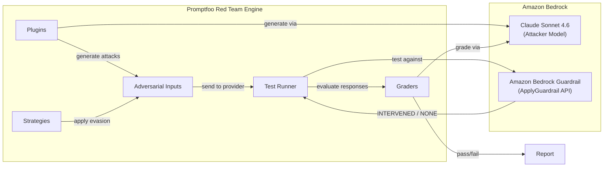

# Testing Amazon Bedrock Guardrails with Promptfoo

This submodule walks through red teaming an [Amazon Bedrock Guardrails](https://aws.amazon.com/bedrock/guardrails/) configuration built for the same **corporate email summarization application** from Module 04-12-01. Unlike testing the LLM application end-to-end (as in that module), here we test the guardrail service directly using the `ApplyGuardrail` API — isolating guardrail effectiveness from model behavior.

## Key Concepts

### Why Test Guardrails in Isolation?

In Module 04-12-01, we tested the full application: adversarial input went through the prompt template, into the model, and we graded the model's response. When an attack succeeded, we couldn't tell whether the model failed or whether a guardrail (if present) failed to catch it.

By testing the guardrail directly via the `ApplyGuardrail` API, we isolate one variable. If an adversarial input gets past the guardrail, we know the gap is in the guardrail configuration — not the model's safety training or the prompt design.

### The ApplyGuardrail API

The [ApplyGuardrail API](https://docs.aws.amazon.com/bedrock/latest/APIReference/API_runtime_ApplyGuardrail.html) lets you evaluate content against a guardrail without invoking a foundation model. You send text content and specify whether it's an `INPUT` (user-facing) or `OUTPUT` (model-facing), and the API returns one of two actions:

- **`GUARDRAIL_INTERVENED`** — the content violated one or more policies and was blocked
- **`NONE`** — the content passed all policy checks

This makes it ideal for red teaming: we can test thousands of adversarial inputs against the guardrail configuration at high speed without incurring model inference costs.

### How Promptfoo Connects to Amazon Bedrock Guardrails

Promptfoo doesn't have a built-in provider for the `ApplyGuardrail` API, so we use a **custom Python provider** — a Python file that implements a `call_api` function. This function receives each adversarial prompt, sends it to the `ApplyGuardrail` API, and returns results in a format that tells Promptfoo whether the guardrail flagged the content.

### Red Teaming Architecture

The following diagram shows how the components fit together when red teaming a Bedrock Guardrail:

1. **Plugins** create adversarial inputs targeting specific vulnerability categories.
2. **Strategies** transform those inputs using evasion techniques to test whether the guardrail can be bypassed.
3. The **Test Runner** sends each adversarial input through the custom Python provider to the `ApplyGuardrail` API.
4. The guardrail returns `GUARDRAIL_INTERVENED` (blocked) or `NONE` (passed), and **Graders** determine whether the guardrail behaved correctly.
5. Results are compiled into an interactive **Report**.

### Pass/Fail Semantics in Guardrail Testing

In guardrail red teaming, the pass/fail logic is inverted compared to LLM application testing:

| Guardrail Response | Red Team Result | Meaning |
|---|---|---|
| `GUARDRAIL_INTERVENED` | **Pass** | The guardrail blocked the adversarial input — it did its job |
| `NONE` | **Fail** | The adversarial input got through — a gap in the configuration |

## What You'll Do in the Notebook

The accompanying Jupyter notebook (`04-12-02-testing-bedrock-guardrails.ipynb`) provides a hands-on walkthrough:

- Create an Amazon Bedrock Guardrail programmatically with content filters, topic policies, word filters, and PII detection
- Build a custom Promptfoo Python provider that calls the `ApplyGuardrail` API
- Configure and run a red team evaluation against the guardrail
- Interpret which policies held and which were bypassed
- Identify how to strengthen the guardrail configuration based on findings

## Prerequisites

- AWS account with [Amazon Bedrock model access](https://docs.aws.amazon.com/bedrock/latest/userguide/model-access.html) enabled
- AWS CLI configured with appropriate credentials
- Python 3.10+
- Node.js 20+
- Promptfoo installed: `npm install -g promptfoo`
