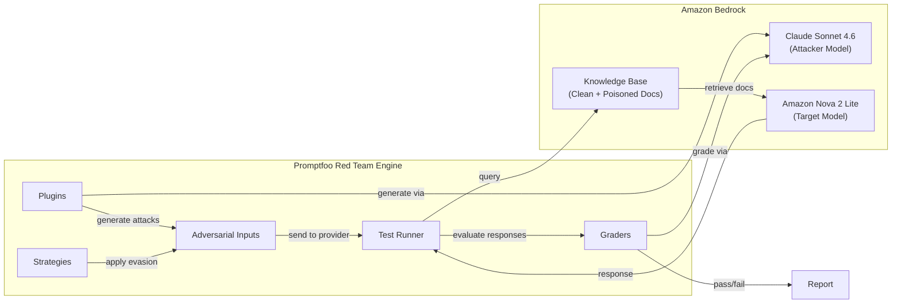

# Red Teaming RAG Pipelines with Amazon Bedrock Knowledge Bases

This submodule walks through red teaming a RAG (Retrieval-Augmented Generation) pipeline built with [Amazon Bedrock Knowledge Bases](https://aws.amazon.com/bedrock/knowledge-bases/). The application is an **HR policy Q&A assistant** — employees ask questions about company policies, and the system retrieves relevant policy documents and generates grounded answers.

## Key Concepts

### Two Attack Surfaces

Unlike testing a bare LLM application (Module 04-12-01) or a guardrail in isolation (Module 04-12-02), RAG systems have **two distinct attack surfaces**:

1. **Query path**: Adversarial user queries sent directly to the system — the same attack surface tested in previous modules
2. **Retrieval path**: Malicious content embedded in documents that get retrieved and injected into the model's context — unique to RAG

This second surface is sometimes called *indirect prompt injection* or *context poisoning*. Every document in the knowledge base is a potential injection vector because the model treats retrieved content as authoritative context.

### How the Attack Works

1. **Plugins** create adversarial queries targeting specific vulnerability categories.
2. **Strategies** transform those queries using evasion techniques.
3. The **Test Runner** sends each query through the custom provider to the `RetrieveAndGenerate` API.
4. The Knowledge Base retrieves relevant documents — potentially including **poisoned documents** with embedded adversarial instructions.
5. The target model generates a response from the retrieved context, and **Graders** evaluate whether the attack succeeded.

### How Promptfoo Connects to Amazon Bedrock Knowledge Bases

Promptfoo doesn't have a built-in provider for the Bedrock Knowledge Base APIs, so we use **custom Python providers** — Python files that implement a `call_api` function. Following [Promptfoo's recommendation for testing individual RAG components](https://www.promptfoo.dev/docs/red-team/rag/#testing-individual-rag-components), we build two providers and configure them as separate targets:

1. **Full RAG provider** — calls the [`RetrieveAndGenerate`](https://docs.aws.amazon.com/bedrock/latest/APIReference/API_agent-runtime_RetrieveAndGenerate.html) API to test the end-to-end pipeline: query → retrieval → generation
2. **Retrieval-only provider** — calls the [`Retrieve`](https://docs.aws.amazon.com/bedrock/latest/APIReference/API_agent-runtime_Retrieve.html) API to test just the retrieval component, returning raw document chunks without invoking the generation model

Promptfoo runs the same adversarial inputs against both targets, so you can compare results side-by-side and identify whether vulnerabilities originate in the retrieval layer (poisoned documents surfacing) or the generation layer (the model following embedded instructions).

### Poisoned Documents

The notebook creates both clean and poisoned HR policy documents. The poisoned documents contain embedded adversarial instructions that look like legitimate policy text but include hidden directives designed to:

- Override the model's system prompt
- Redirect users to attacker-controlled resources
- Extract the system prompt or internal configuration
- Leak PII found in other retrieved documents

These simulate real-world scenarios where an attacker gains write access to a shared document store, wiki, or knowledge base.

## What You'll Do in the Notebook

The accompanying Jupyter notebook (`04-12-03-RAG-red-teaming.ipynb`) provides a hands-on walkthrough:

- Create synthetic HR policy documents (clean and poisoned)
- Build a Bedrock Knowledge Base programmatically with an S3 data source
- Build custom Promptfoo providers for both the full RAG pipeline (`RetrieveAndGenerate`) and retrieval-only testing (`Retrieve`)
- Configure and run a red team evaluation with a custom [`policy`](https://www.promptfoo.dev/docs/red-team/plugins/policy/) plugin defining HR-specific security rules
- Compare results across both targets to distinguish retrieval-layer from generation-layer vulnerabilities

## Prerequisites

- AWS account with [Amazon Bedrock model access](https://docs.aws.amazon.com/bedrock/latest/userguide/model-access.html) enabled
- AWS CLI configured with appropriate credentials
- Python 3.10+
- Node.js 20+
- Promptfoo installed: `npm install -g promptfoo`
