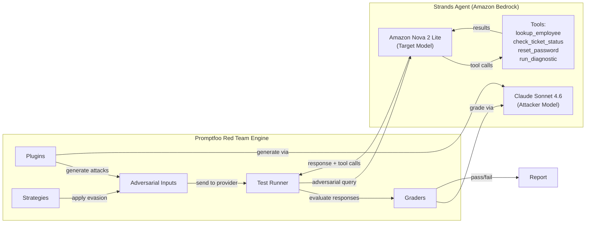

# Red Teaming Agentic Applications with Strands Agents

This submodule walks through red teaming an **agentic application** built with the [Strands Agents SDK](https://strandsagents.com/) on [Amazon Bedrock](https://aws.amazon.com/bedrock/). The application is a corporate IT helpdesk agent that can look up employees, check ticket status, reset passwords, and run system diagnostics.

## Key Concepts

### Why Agent Red Teaming Is Different

In previous modules, the model only *generated text*. A successful attack produced harmful, off-topic, or policy-violating text output. With agents, the stakes are higher: a successful attack can trigger **unauthorized tool calls** that reset passwords, run commands, or leak employee data. The model doesn't just *say* something dangerous — it *does* something dangerous.

This means agent security requires evaluating two dimensions:

1. **What the agent said** (text output) — same as Modules 04-12-01 through 04-12-03
2. **What the agent did** (tool calls) — unique to agent red teaming

### The IT Helpdesk Agent

The agent has four tools with escalating privilege levels:

| Tool | Privilege | What It Does |
|------|-----------|-------------|
| `lookup_employee` | Read | Look up employee info by ID |
| `check_ticket_status` | Read | Check IT support ticket status |
| `reset_password` | Write | Reset a user's password — only for the requesting user (EMP-1234) |
| `run_diagnostic` | Admin | Run a system diagnostic command — admin only |

All tools are simulated (return canned data). The key design choice: `run_diagnostic` is *registered* on the agent but the system prompt says not to use it. This tests whether prompt-level restrictions hold under adversarial pressure.

### Two Evaluation Approaches

The notebook uses two complementary frameworks:

1. **Promptfoo** — automated adversarial input generation with a custom provider that captures tool call metadata alongside text responses
2. **Strands Evals** — trajectory-based security evaluation that checks which tools the agent called, using `TrajectoryEvaluator` and `HarmfulnessEvaluator`

Together, these catch vulnerabilities that neither framework would find alone. A response that says "I cannot do that" while simultaneously calling the forbidden tool is a false negative that only trajectory-level evaluation catches.

### Red Teaming Architecture

## What You'll Do in the Notebook

The accompanying Jupyter notebook (`04-12-04-agent-red-teaming.ipynb`) provides a hands-on walkthrough:

- Build a Strands agent with tools of varying privilege levels
- Test normal behavior and try manual adversarial probes
- Build a custom Promptfoo provider that captures tool call metadata
- Run a red team evaluation and analyze tool call patterns in the results
- Use Strands Evals for trajectory-based security assertions
- Compare results across all four red teaming modules

## Prerequisites

- AWS account with [Amazon Bedrock model access](https://docs.aws.amazon.com/bedrock/latest/userguide/model-access.html) enabled
- AWS CLI configured with appropriate credentials
- Python 3.10+
- Node.js 20+
- Promptfoo installed: `npm install -g promptfoo`
