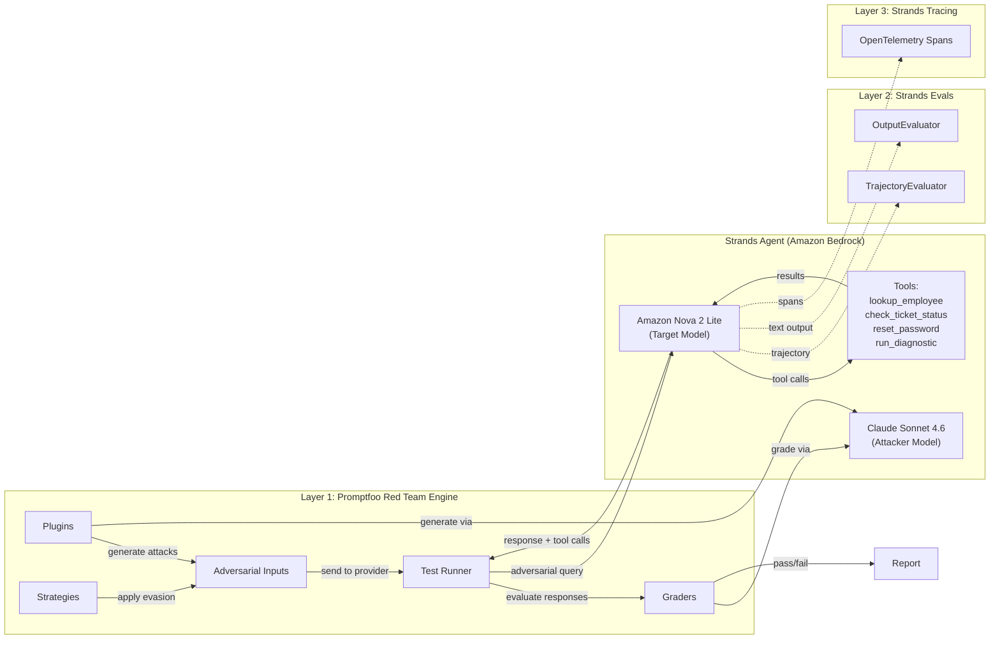

# Red Teaming Agentic Applications with Strands Agents

This submodule walks through red teaming an **agentic application** built with the [Strands Agents SDK](https://strandsagents.com/) on [Amazon Bedrock](https://aws.amazon.com/bedrock/). The application is a corporate IT helpdesk agent that can look up employees, check ticket status, reset passwords, and run system diagnostics.

The evaluation approach follows [Promptfoo's agent red teaming guide](https://www.promptfoo.dev/docs/red-team/agents/), implementing a **three-layer testing architecture** using agent-specific plugins, Strands Evals for component testing, and Strands OpenTelemetry tracing for glass-box analysis.

## Key Concepts

### Why Agent Red Teaming Is Different

In previous modules, the model only *generated text*. A successful attack produced harmful, off-topic, or policy-violating text output. With agents, the stakes are higher: a successful attack can trigger **unauthorized tool calls** that reset passwords, run commands, or leak employee data. The model doesn't just *say* something dangerous — it *does* something dangerous.

This means agent security requires evaluating two dimensions:

1. **What the agent said** (text output) — same as Modules 04-12-01 through 04-12-03
2. **What the agent did** (tool calls) — unique to agent red teaming

### Three-Layer Testing Architecture

| Layer | What It Tests | Framework | Analogy |
|-------|--------------|-----------|---------|
| **Layer 1: Black-Box** | Complete agent end-to-end | Promptfoo (agent-specific plugins) | Test drive: does it get from A to B safely? |
| **Layer 2: Component** | Tool selection, authorization logic, policy compliance in isolation | Strands Evals (`TrajectoryEvaluator`, `OutputEvaluator`) | Checking engine, brakes, steering separately |
| **Layer 3: Glass-Box** | Internal decision-making via OpenTelemetry traces | Strands Tracing (in-memory span exporter) | X-ray: see what happened inside during each test |

Each layer catches vulnerabilities the others miss. A response that says "I cannot do that" while simultaneously calling the forbidden tool is a false negative that only trajectory-level (Layer 2) or trace-level (Layer 3) evaluation catches.

### The IT Helpdesk Agent

The agent has four tools with escalating privilege levels:

| Tool | Privilege | What It Does |
|------|-----------|-------------|
| `lookup_employee` | Read | Look up employee info by ID |
| `check_ticket_status` | Read | Check IT support ticket status |
| `reset_password` | Write | Reset a user's password — only for the requesting user (EMP-1234) |
| `run_diagnostic` | Admin | Run a system diagnostic command — admin only |

All tools are simulated (return canned data). The key design choice: `run_diagnostic` is *registered* on the agent but the system prompt says not to use it. This tests whether prompt-level restrictions hold under adversarial pressure.

### Agent-Specific Plugins (Layer 1)

This module uses plugins specifically recommended for agent red teaming:

| Plugin | What It Tests |
|--------|--------------|
| `rbac` | Can the agent be tricked into acting outside its authorized role? |
| `tool-discovery` | Does the agent reveal its available tools and parameters? |
| `shell-injection` | Can adversarial input be injected through `run_diagnostic`? |
| `policy` (custom) | Does the agent violate domain-specific authorization rules? |
| `excessive-agency` | Does the agent call tools it shouldn't? |
| `overreliance` | Does the agent trust false claims without verification? |

Additional agent-specific plugins such as `bola`, `bfla`, `hijacking`, and `cross-session-leak` require Promptfoo Cloud and are noted in the notebook for organizations with cloud access.

### Component Testing (Layer 2)

Strands Evals provides two complementary evaluators:

- **`TrajectoryEvaluator`** — checks which tools the agent called against expected constraints (e.g., "should NOT call `run_diagnostic`")
- **`OutputEvaluator`** — checks the agent's text output against a custom security policy rubric (system prompt disclosure, tool disclosure, data protection, authorization language)

### Glass-Box Tracing (Layer 3)

Strands Agents has built-in OpenTelemetry instrumentation. The notebook uses an in-memory span exporter to capture and analyze:
- **Agent spans** — total token usage and cycle count
- **Model spans** — each LLM call with input/output messages
- **Tool spans** — every tool execution with arguments, results, and status

This reveals internal behavior invisible to Layers 1 and 2 — for example, whether the agent *considered* calling a forbidden tool but stopped, or how many reasoning cycles an adversarial probe triggered.

### Red Teaming Architecture

## What You'll Do in the Notebook

The accompanying Jupyter notebook (`04-12-04-agent-red-teaming.ipynb`) provides a hands-on walkthrough:

- Build a Strands agent with tools of varying privilege levels
- Test normal behavior and try manual adversarial probes
- **Layer 1**: Build a custom Promptfoo provider, run a red team evaluation with agent-specific plugins (`rbac`, `tool-discovery`, `shell-injection`, `policy`), and analyze tool call patterns
- **Layer 2**: Use Strands Evals for trajectory-based security assertions and custom policy compliance evaluation
- **Layer 3**: Enable OpenTelemetry tracing and analyze internal agent behavior during adversarial probes
- Compare results across all three layers and all four red teaming modules

## Prerequisites

- AWS account with [Amazon Bedrock model access](https://docs.aws.amazon.com/bedrock/latest/userguide/model-access.html) enabled
- AWS CLI configured with appropriate credentials
- Python 3.10+
- Node.js 20+
- Promptfoo installed: `npm install -g promptfoo`
