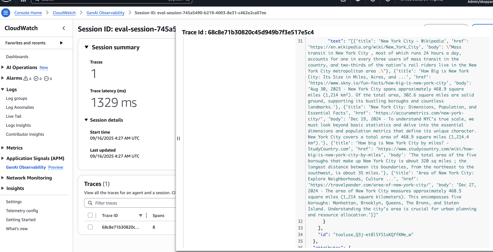

# Amazon Bedrock AgentCore Evaluation Framework

Comprehensive evaluation tools for AI agents deployed on Amazon Bedrock AgentCore Runtime, providing both deployment capabilities and sophisticated evaluation methodologies.
This section of the workshop is structured into 2 parts. In the 1st part we deploy an agent we created in 03 onto AgentCore Runtime. And in the 2nd part we push run evaluations against the deployed agent through the evaluations notebook. 

## 📁 Repository Structure

```
05-04-AgentCore/
├── 05-04-03-README.md                 # This guide
├── 05-04-04-requirements.txt          # Python dependencies
├── 05-04-01-Agentic-Metrics-AgentCore.ipynb # Agent deployment and basic metrics
├── 05-04-02-Agent-and-tool-evals-with-xray.ipynb # Advanced evaluation with X-Ray observability
├── AgentCore-Evaluation.ipynb         # Comprehensive evaluation framework (recommended)
├── AgentCore-Cleanup.ipynb            # Resource cleanup and account ID masking
├── citysearch.py                      # city search agent - Generated in 05-04-01-Agentic-Metrics-AgentCore.ipynb 
├── Dockerfile                         # Container configuration - Generated in 05-04-01-Agentic-Metrics-AgentCore.ipynb
├── .bedrock_agentcore.yaml            # AgentCore configuration - Generated in 05-04-01-Agentic-Metrics-AgentCore.ipynb
├── .dockerignore                      # Docker ignore file - Generated implicitly in 05-04-01-Agentic-Metrics-AgentCore.ipynb
├── evaluation_results_*.json          # Evaluation output files - Generated in 05-04-02-Agent-and-tool-evals-with-xray.ipynb
└── images/                            # AgentCore observability screenshots - For reference
    ├── Citysearch-AgentCore-Obs-1.png # Runtime overview dashboard
    ├── Citysearch-AgentCore-Obs-2.png # Performance metrics
    ├── Citysearch-AgentCore-Obs-3.png # Request tracing
    └── Citysearch-AgentCore-Obs-4.png # Advanced analytics
```

## 📚 Notebooks Overview

### 1. 05-04-01-Agentic-Metrics-AgentCore.ipynb
**Agent Development and Deployment Pipeline**

- Creates and deploys city search agents using Strands framework
- Integrates with AgentCore Runtime for AWS deployment
- Uses Amazon Nova Micro model with DuckDuckGo web search
- Demonstrates production-ready agent implementation

### 2. 05-04-02-Agent-and-tool-evals-with-xray.ipynb
**Advanced Evaluation Framework with X-Ray Observability**

- Multi-dimensional quality assessment (helpfulness, accuracy, clarity, professionalism, completeness)
- LLM-as-Judge evaluation using Claude Sonnet
- Advanced X-Ray integration for distributed tracing
- Tool usage analysis and performance monitoring
- Session-based trace filtering and comprehensive reporting

### 3. AgentCore-Evaluation.ipynb (Recommended)
**Comprehensive Evaluation Framework**

- **Enhanced User Experience**: Streamlined interface with automated agent ARN detection
- **Extended Test Coverage**: 6 comprehensive test cases covering various scenarios
- **Rich Visualizations**: Quality metrics charts, response time distributions, performance analysis
- **Detailed Reporting**: Individual test case analysis with recommendations
- **Multiple Output Formats**: JSON, CSV, and Markdown reports
- **Account ID Security**: Built-in masking for safe GitHub commits

### 4. AgentCore-Cleanup.ipynb
**Resource Cleanup and Security**

- **Complete Resource Removal**: Deletes all AgentCore resources (runtime, ECR, IAM roles, etc.)
- **Account ID Masking**: Cleans notebook outputs to remove sensitive information
- **Cost Prevention**: Ensures no resources are left running after testing
- **GitHub Safety**: Makes notebooks safe for public repository commits

## 🚀 Quick Start

### Prerequisites
- AWS Account with Bedrock and AgentCore permissions
- Python 3.8+ with Jupyter
- AWS CLI configured

### Installation
```bash
pip install -r requirements.txt
```

### Usage
1. **Deploy Agent**: Run `05-04-01-Agentic-Metrics-AgentCore.ipynb`
2. **Evaluate Agent**: Run `AgentCore-Evaluation.ipynb` (recommended) or `05-04-02-Agent-and-tool-evals-with-xray.ipynb`
3. **Clean Up Resources**: Run `AgentCore-Cleanup.ipynb` to remove all AWS resources and mask account IDs

## 🏙️ City Search Agent (citysearch.py)

Production-ready conversational AI agent for city information queries.

**Key Features:**
- **Model**: Amazon Nova Micro (optimized for latency/cost)
- **Tool**: DuckDuckGo web search with regional optimization
- **Integration**: Four-line AgentCore Runtime pattern
- **Output**: Structured XML tags for programmatic processing

```python
# AgentCore Integration Pattern
from bedrock_agentcore.runtime import BedrockAgentCoreApp
app = BedrockAgentCoreApp()

@app.entrypoint
def invoke(payload):
    return chatbot(payload.get("prompt", ""))

if __name__ == "__main__":
    app.run()
```

## 📊 AgentCore Observability

AgentCore provides comprehensive monitoring through four key dashboards:

### 1. Runtime Overview

- Agent status, request volume, performance indicators, resource utilization

### 2. Performance Metrics

- Response time analysis, throughput monitoring, error tracking, trend analysis

### 3. Request Tracing

- Individual request traces, tool call visualization, timing breakdowns, error context

### 4. Advanced Analytics

- Usage patterns, performance optimization, cost analysis, quality metrics

**Integration with Evaluation Framework:**
```python
def extract_agentcore_metrics(agent_arn, time_range):
    return {
        'response_times': get_response_time_percentiles(agent_arn, time_range),
        'success_rate': get_success_rate(agent_arn, time_range),
        'tool_usage': get_tool_usage_stats(agent_arn, time_range)
    }
```

## 📈 Evaluation Results

Sample evaluation output:
```
🤖 Agent: citysearch
📝 Total Test Cases: 3
✅ Success Rate: 100.0%
🎯 Overall Score: 4.61/5.0

📈 QUALITY METRICS (1-5 scale):
  🟢 Helpfulness: 4.33    🟢 Accuracy: 4.67
  🟢 Clarity: 5.00        🟢 Professionalism: 4.33
  🟢 Completeness: 4.33   🟢 Tool_Usage: 5.00

⏱️ RESPONSE TIME PERCENTILES:
  P50: 3.529s  P90: 3.721s  P95: 3.721s  P99: 3.721s
```

## 🔧 Key Technologies

**Dependencies (requirements.txt):**
- `strands-agents` - Core agent framework
- `boto3` - AWS SDK for Bedrock/X-Ray integration
- `bedrock-agentcore` - AgentCore runtime
- `ddgs` - DuckDuckGo search integration
- `pandas` - Data processing for metrics

**AWS Services:**
- Amazon Bedrock (Foundation models)
- AgentCore Runtime (Agent deployment)
- AWS X-Ray (Distributed tracing)
- CloudWatch (Metrics and logging)


## 🔒 Optional - Account ID Security & Masking

This repository includes automated security measures to prevent AWS account IDs from being exposed in published notebooks.
Below is the script which has been added to the repo (.git/hooks/pre-commit). You can customize it in your local git repo:
```
#!/bin/bash
set -e

# Get only staged files in the target directory
staged_files=$(git diff --cached --name-only --diff-filter=ACM | grep "^05-framework-specific-evaluations/05-04-AgentCore/.*\.\(ipynb\|py\)$" || true)

if [ -n "$staged_files" ]; then
    python3 "05-framework-specific-evaluations/05-04-AgentCore/05-04-04-optional-clean-notebooks.py" $staged_files
    git add $staged_files
fi
```

### How Account ID Masking Works

1. **Pre-commit Hook**: Git automatically runs `05-04-04-optional-clean-notebooks.py` before each commit
2. **Pattern Detection**: Scans notebook outputs for 12-digit numbers (AWS account ID format)  
3. **Safe Replacement**: Replaces account IDs with `XXXXXXXXXXXX` while preserving all other outputs
4. **Re-staging**: Automatically adds cleaned notebooks back to the commit

**Note**: This repository uses account ID masking instead of complete output removal to maintain notebook functionality while ensuring security.
