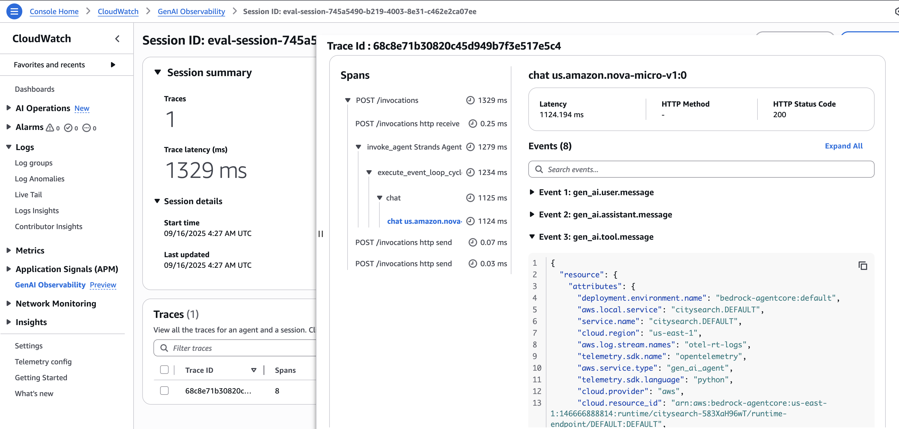

# Amazon Bedrock AgentCore Evaluation Framework

Comprehensive evaluation tools for AI agents deployed on Amazon Bedrock AgentCore Runtime, providing both deployment capabilities and sophisticated evaluation methodologies.

## 📁 Repository Structure

```
05-04-AgentCore/
├── README.md                           # This guide
├── requirements.txt                    # Python dependencies
├── Agentic-Metrics-AgentCore.ipynb    # Agent deployment and basic metrics
├── Agent-and-tool-evals-with-xray.ipynb # Advanced evaluation with X-Ray observability
├── AgentCore-Cleanup.ipynb           # Resource cleanup and account ID masking
├── citysearch.py                      # Generated city search agent
├── Dockerfile                         # Container configuration
├── .bedrock_agentcore.yaml            # AgentCore configuration
└── images/                            # AgentCore observability screenshots
    ├── Citysearch-AgentCore-Obs-1.png # Runtime overview dashboard
    ├── Citysearch-AgentCore-Obs-2.png # Performance metrics
    ├── Citysearch-AgentCore-Obs-3.png # Request tracing
    └── Citysearch-AgentCore-Obs-4.png # Advanced analytics
```

## 📚 Notebooks Overview

### 1. Agentic-Metrics-AgentCore.ipynb
**Agent Development and Deployment Pipeline**

- Creates and deploys city search agents using Strands framework
- Integrates with AgentCore Runtime for AWS deployment
- Uses Amazon Nova Micro model with DuckDuckGo web search
- Demonstrates production-ready agent implementation

### 2. Agent-and-tool-evals-with-xray.ipynb
**Advanced Evaluation Framework with X-Ray Observability**

- Multi-dimensional quality assessment (helpfulness, accuracy, clarity, professionalism, completeness)
- LLM-as-Judge evaluation using Claude Sonnet
- Advanced X-Ray integration for distributed tracing
- Tool usage analysis and performance monitoring
- Session-based trace filtering and comprehensive reporting

## 🚀 Quick Start

### Prerequisites
- AWS Account with Bedrock and AgentCore permissions
- Python 3.8+ with Jupyter
- AWS CLI configured

### Installation
```bash
pip install -r requirements.txt
```

### Usage
1. **Deploy Agent**: Run `Agentic-Metrics-AgentCore.ipynb`
2. **Evaluate Agent**: Run `Agent-and-tool-evals-with-xray.ipynb` with your agent ARN
3. **Clean Up Resources**: Run `AgentCore-Cleanup.ipynb` to remove all AWS resources and mask account IDs

## 🏙️ City Search Agent (citysearch.py)

Production-ready conversational AI agent for city information queries.

**Key Features:**
- **Model**: Amazon Nova Micro (optimized for latency/cost)
- **Tool**: DuckDuckGo web search with regional optimization
- **Integration**: Four-line AgentCore Runtime pattern
- **Output**: Structured XML tags for programmatic processing

```python
# AgentCore Integration Pattern
from bedrock_agentcore.runtime import BedrockAgentCoreApp
app = BedrockAgentCoreApp()

@app.entrypoint
def invoke(payload):
    return chatbot(payload.get("prompt", ""))

if __name__ == "__main__":
    app.run()
```

## 📊 AgentCore Observability

AgentCore provides comprehensive monitoring through four key dashboards:

### 1. Runtime Overview

- Agent status, request volume, performance indicators, resource utilization

### 2. Performance Metrics

- Response time analysis, throughput monitoring, error tracking, trend analysis

### 3. Request Tracing

- Individual request traces, tool call visualization, timing breakdowns, error context

### 4. Advanced Analytics

- Usage patterns, performance optimization, cost analysis, quality metrics

**Integration with Evaluation Framework:**
```python
def extract_agentcore_metrics(agent_arn, time_range):
    return {
        'response_times': get_response_time_percentiles(agent_arn, time_range),
        'success_rate': get_success_rate(agent_arn, time_range),
        'tool_usage': get_tool_usage_stats(agent_arn, time_range)
    }
```

## 📈 Evaluation Results

Sample evaluation output:
```
🤖 Agent: citysearch
📝 Total Test Cases: 3
✅ Success Rate: 100.0%
🎯 Overall Score: 4.61/5.0

📈 QUALITY METRICS (1-5 scale):
  🟢 Helpfulness: 4.33    🟢 Accuracy: 4.67
  🟢 Clarity: 5.00        🟢 Professionalism: 4.33
  🟢 Completeness: 4.33   🟢 Tool_Usage: 5.00

⏱️ RESPONSE TIME PERCENTILES:
  P50: 3.529s  P90: 3.721s  P95: 3.721s  P99: 3.721s
```

## 🔧 Key Technologies

**Dependencies (requirements.txt):**
- `strands-agents` - Core agent framework
- `boto3` - AWS SDK for Bedrock/X-Ray integration
- `bedrock-agentcore` - AgentCore runtime
- `ddgs` - DuckDuckGo search integration
- `pandas` - Data processing for metrics

**AWS Services:**
- Amazon Bedrock (Foundation models)
- AgentCore Runtime (Agent deployment)
- AWS X-Ray (Distributed tracing)
- CloudWatch (Metrics and logging)

## 🎯 Best Practices

**Agent Development:**
1. Start with basic functionality, add complexity incrementally
2. Implement robust error handling and fallback mechanisms
3. Optimize model selection for latency vs. accuracy trade-offs

**Evaluation Strategy:**
1. Establish performance baselines before optimization
2. Use comprehensive test coverage including edge cases
3. Implement continuous monitoring in production

**Production Deployment:**
1. Deploy incrementally with monitoring at each stage
2. Set up alerts for performance degradation
3. Maintain quality gates for deployment approval

**Resource Management:**
1. Use `AgentCore-Cleanup.ipynb` to clean up AWS resources after testing
2. Always run cleanup before committing notebooks to GitHub
3. Verify resource deletion in AWS Console to avoid unexpected costs

