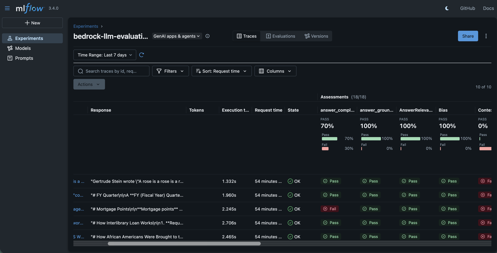

# 05-06 MLflow RAG Generation Evaluation with Amazon Bedrock

## Overview

This module demonstrates how to use **[MLflow](https://mlflow.org/)** to evaluate the **generation step of a RAG pipeline** on Amazon Bedrock, and track all results (metrics, parameters, artifacts, traces) in a single place.

The retrieved context is supplied by the dataset (no retriever is run), so the metrics measure how faithfully each Bedrock model grounds its answer in that context — **not** how well a retriever finds it. This is sometimes called "end-to-end generation eval with fixed ground-truth context". If you want to evaluate retrieval (recall@k, precision@k, MRR, context precision/recall), that is out of scope here.

Unlike the other 05-\* modules, this one focuses purely on **generator-quality evaluation** — we call Bedrock directly via the Converse API and use LLM-as-Judge plus code-based scorers. No local agent wrapper, no agent-behavior evaluation.

## What You'll Learn

- How to structure a RAG generation evaluation dataset for `mlflow.genai.evaluate()` (`{inputs: {question, context}, expectations: {...}}`)
- How to run a comprehensive evaluation with **18 scorers** across five categories, including RAG-grounding scorers (`Faithfulness`, `Hallucination`, `answer_groundedness`, `factual_consistency`)
- How to log parameters, metrics, and artifacts to MLflow
- How to query and compare multiple model runs using `mlflow.search_runs`
- How to bootstrap a serverless **SageMaker-managed MLflow App** (S3 bucket, IAM role, App) directly from the notebook

## Evaluation Scorers (18 total)

| Category                             | Scorers                                                                                       | What they measure                               |
| ------------------------------------ | --------------------------------------------------------------------------------------------- | ----------------------------------------------- |
| **MLflow built-in LLM-as-Judge**     | `RelevanceToQuery`, `Equivalence`, `Fluency`                                                  | Response quality against query and ground truth |
| **MLflow Guidelines (LLM-as-Judge)** | `answer_groundedness`, `answer_completeness`                                                  | Custom pass/fail criteria                       |
| **Custom `make_judge`**              | `factual_consistency`, `professionalism`, `correctness`                                       | Domain-specific LLM-as-Judge                    |
| **DeepEval via Bedrock**             | `Faithfulness`, `AnswerRelevancy`, `ContextualRelevancy`, `Hallucination`, `Toxicity`, `Bias` | RAG + safety metrics with claim decomposition   |
| **Code-based**                       | `exact_match`, `is_concise`, `word_overlap`, `response_length`                                | Deterministic heuristic metrics                 |

## Dataset

Uses [explodinggradients/ragas-wikiqa](https://huggingface.co/datasets/explodinggradients/ragas-wikiqa) from HuggingFace:

- `question` — input questions
- `correct_answer` — ground truth
- `context` — retrieved passages

## Prerequisites

- AWS account with Bedrock model access
- Python 3.10+
- AWS credentials configured locally.
- Optional `.env` file (loaded via `python-dotenv`) to pin `AWS_REGION`, `AWS_PROFILE`, or explicit access keys for this notebook.
- If you plan to use the serverless **SageMaker MLflow App** path, your caller also needs IAM permissions to create/describe S3 buckets, IAM roles/policies, and `sagemaker:CreateMlflowApp` / `DescribeMlflowApp` / `ListMlflowApps` / `CreatePresignedMlflowAppUrl`.
- Set up a Python environment and install the requirements in `requirements.txt`. For example, if you are using `uv`, run:

```
uv venv .venv
source .venv/bin/activate
uv pip install -r requirements.txt
```

The requirements.txt contains the following dependencies:

```
mlflow>=3.8.0
sagemaker-mlflow>=0.3.0
deepeval
datasets
boto3>=1.42.4
botocore[crt]
pandas
nest_asyncio
litellm
python-dotenv
```

`boto3>=1.42.4` is required for the `sagemaker:CreateMlflowApp` API (GA Dec 2025).

## MLflow Tracking Backend

The notebook supports two backends, chosen at runtime by whether the bootstrap variables (`MLFLOW_APP_NAME`, `MLFLOW_ARTIFACT_S3`, `MLFLOW_APP_ROLE_ARN`) are populated.

### Local store (default fallback)

Clear `MLFLOW_APP_NAME` and the notebook writes runs to `./mlruns`. No cloud resources are created.

### SageMaker-managed MLflow App (auto-bootstrapped)

By default the notebook bootstraps and reuses a serverless MLflow App. Three cells run idempotently:

1. **S3 bucket + IAM role** — creates `mlflow-artifacts-<account>-<region>` and the `sagemaker-mlflow-app-servicerole` role (with S3 + `sagemaker-mlflow:*` + model-registry permissions). Both are reused if they already exist.
2. **MLflow App** — calls `sagemaker:CreateMlflowApp` on first run (retries while IAM trust propagates), then polls `describe_mlflow_app` until the App reaches `Created`. Subsequent runs reuse the existing App via `list_mlflow_apps`. The account quota of **3 MLflow Apps** is enforced client-side with a clear error message.
3. **Tracking URI** — the resolved App ARN is written to `MLFLOW_TRACKING_URI` and `os.environ["MLFLOW_TRACKING_URI"]` so the `sagemaker-mlflow` plugin handles SigV4 auth transparently.

To customize the App name or S3 bucket, edit `MLFLOW_APP_NAME` / `MLFLOW_S3_BUCKET` in the bootstrap cell.

## Getting Started

Open `05-06-01-Mlflow-Evaluation.ipynb` and run the cells top-to-bottom.

The notebook walks you through:

1. Loading `.env`, resolving AWS credentials, and initializing Bedrock / STS / IAM / S3 / SageMaker clients
2. Bootstrapping (or reusing) the S3 bucket, IAM service role, and serverless SageMaker MLflow App
3. Loading and shaping the evaluation dataset into `{inputs, expectations}` records
4. Defining code-based scorers, custom `make_judge` scorers, MLflow Guidelines, and DeepEval scorers (18 total)
5. Running `mlflow.genai.evaluate()` for `claude-sonnet-4-5` and `claude-haiku-4-5`
6. Logging per-sample CSV artifacts to each MLflow run
7. Comparing both models side-by-side via `mlflow.search_runs`
8. Rendering a clickable, presigned MLflow UI link (valid 5 minutes) via `IPython.display.HTML`

## Viewing Results

### Local MLflow UI

```bash
mlflow ui --backend-store-uri ./mlruns
```

Then open http://localhost:5000 in your browser.

### SageMaker MLflow App

The final notebook cell renders a clickable presigned URL (valid 5 minutes) using the `get_mlflow_app_ui_url()` helper defined earlier in the notebook. Re-run that cell to get a fresh link.

Equivalent CLI:

```bash
aws sagemaker create-presigned-mlflow-app-url \
    --arn "$MLFLOW_TRACKING_URI" \
    --region <your-region>
```

Opening the presigned URL loads the MLflow UI hosted by the SageMaker MLflow App — run list, metric comparison, per-sample scorer results, and artifact downloads all live here:



## Resources

- [MLflow GenAI Evaluation docs](https://mlflow.org/docs/latest/llms/llm-evaluate/index.html)
- [mlflow.genai.scorers reference](https://mlflow.org/docs/latest/python_api/mlflow.genai.scorers.html)
- [DeepEval on MLflow](https://mlflow.org/docs/latest/llms/llm-evaluate/notebooks/index.html)
- [SageMaker-managed MLflow](https://docs.aws.amazon.com/sagemaker/latest/dg/mlflow.html)
