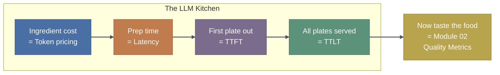

# Operational Metrics for Amazon Bedrock - Trainer's Guide: Measuring What You Pay For

## At a Glance

| Item | Detail |
|------|--------|
| **Notebooks** | `01-Operational-Metrics.ipynb` (single notebook, five sections) |
| **Prerequisites** | AWS account with Bedrock access to four models (Nova 2 Lite, Nova Pro, Claude Haiku 4.5, Claude Sonnet 5); `cloudwatch:PutMetricData` IAM permission; Python 3.10+ with boto3 and pandas |
| **Key Takeaway** | Operational metrics tell you how fast, how much, and how smooth, but they never tell you how good. This module builds the measurement foundation; Module 02 evaluates quality. |

---

## The Real-World Hook: The Restaurant Kitchen

Before opening notebooks, tell this story:

> You walk into a restaurant kitchen as a consultant. The owner says "we're losing money but I don't know why." You could start tasting every dish (quality), or you could start with the basics: how long does each dish take to prepare, how much does each ingredient cost, and which dishes are sitting in the pass waiting to be served? That's operational metrics. You're not judging the food yet. You're measuring the kitchen's speed, cost, and flow so you know where to look when something goes wrong. Today we instrument an LLM kitchen the same way.

---

## Module Progression

```mermaid
flowchart LR
    subgraph S1["Section 1: Cost"]
        direction LR
        A["Token pricing\nacross 4 models"]
    end

    subgraph S2["Section 2: Latency"]
        direction LR
        B["Server vs client\nlatency comparison"]
    end

    subgraph S3["Section 3: Streaming"]
        direction LR
        C["TTFT, TTLT\n+ CloudWatch"]
    end

    subgraph S4["Section 4: Apply It"]
        direction LR
        D["Email summarization\nacross all models"]
    end

    subgraph S5["Section 5: Takeaways"]
        direction LR
        E["Model selection\nis a tradeoff"]
    end

    S1 --> |"Cost alone is\nmisleading without\nspeed context"| S2
    S2 --> |"Bulk latency hides\nperceived responsiveness"| S3
    S3 --> |"Theory needs\na real workload"| S4
    S4 --> |"Summarize decisions\nbefore moving to quality"| S5

    style A fill:#4A6FA5,stroke:#3A5A8A,color:#fff
    style B fill:#C17C4E,stroke:#A0663D,color:#fff
    style C fill:#7B6B8D,stroke:#5F5570,color:#fff
    style D fill:#5B9279,stroke:#4A7A64,color:#fff
    style E fill:#B8A44C,stroke:#9A8A3D,color:#fff

    linkStyle default stroke:#4A5568,stroke-width:2px
```

---

## Notebook 1: 01-Operational-Metrics.ipynb

### Real-World Hook

> Back to our restaurant kitchen. You have four chefs (models), each with different ingredient costs (token pricing) and cooking speeds (latency). Before you fire anyone or promote anyone, you need numbers. This notebook gives you the instruments: a cost calculator, a latency timer, a streaming profiler, and a CloudWatch pipeline that publishes it all to a dashboard. By the end, you'll have hard data comparing all four chefs on the same menu item.

### Architecture Visual

```mermaid
flowchart LR
    subgraph Input["Inputs"]
        direction LR
        P["Prompt / Email"] ~~~ M["4 Models via\nmodel_config.py"]
    end

    subgraph Measure["Measurement Layer"]
        direction LR
        CC["calculate_cost()"] ~~~ ML["measure_latency()\nconverse API"] ~~~ MS["measure_streaming_metrics()\nconverse_stream API"]
    end

    subgraph Output["Outputs"]
        direction LR
        T["Styled pandas\ncomparison tables"] ~~~ CW["CloudWatch custom\nmetrics namespace"] ~~~ J["email_responses.json\nfor Module 02"]
    end

    Input --> Measure --> Output

    style P fill:#4A6FA5,stroke:#3A5A8A,color:#fff
    style M fill:#4A6FA5,stroke:#3A5A8A,color:#fff
    style CC fill:#C17C4E,stroke:#A0663D,color:#fff
    style ML fill:#C17C4E,stroke:#A0663D,color:#fff
    style MS fill:#C17C4E,stroke:#A0663D,color:#fff
    style T fill:#5B9279,stroke:#4A7A64,color:#fff
    style CW fill:#7B6B8D,stroke:#5F5570,color:#fff
    style J fill:#B8A44C,stroke:#9A8A3D,color:#fff

    linkStyle default stroke:#4A5568,stroke-width:2px
```

### Say Before They Run

> "This notebook measures four models on cost, latency, and streaming performance. You are not judging which model gives the *best answer* yet; that is Module 02. Right now you are building the operational scorecard: how fast, how expensive, how smooth. Every table you see will compare the same four models on the same task so the comparison is fair. By Section 4, you will run a real email summarization workload and save the results to a JSON file that Module 02 picks up. So if you skip this notebook, Module 02 has no data to evaluate."

### Key Concepts to Explain

| Concept | Explanation |
|---------|-------------|
| **Token pricing tiers** | Bedrock offers five pricing tiers (On-Demand, Priority, Flex, Batch, Reserved). This notebook uses On-Demand, but point out that Flex is often smarter for evaluation workloads since you are not latency-sensitive during evals. The tier choice is per-request via the `serviceTier` parameter, not an account-level toggle. |
| **Tokenizer divergence** | The same prompt produces different input token counts across models because each model uses its own tokenizer. The notebook uses the hallway-in-steps analogy: a tall person and a short person cover the same distance in a different number of steps. This means "price per token" is not comparable across model families. Cost per request is the fair unit. |
| **Server-side vs client-side latency** | `response["metrics"]["latencyMs"]` is server processing time only. `time.time()` around the call captures network overhead too. Production monitoring needs both: server latency tells you about model performance, client latency tells you about user experience. |
| **TTFT vs TTLT** | TTFT (Time to First Token) is how long before the user sees anything. TTLT (Time to Last Token) is total wall-clock time. A model with high TTLT but low TTFT can *feel* faster to a user watching a streaming response. TTFT is the UX metric; TTLT is the throughput metric. |
| **Inter-token latency** | Average gap between consecutive streamed chunks. Jittery streams (high variance) feel worse than smooth ones, even at the same TTLT. This metric tells you how smooth the typing effect will look in a chat UI. |
| **Custom CloudWatch metrics** | The notebook publishes TTFT, TTLT, and cost to a custom namespace (`llm_custom_operational_metrics`) with a `Model` dimension. This is how you build dashboards that let you compare models over time, set alarms, and catch regressions before users report them. |
| **email_responses.json** | Section 4 produces this artifact. It contains the raw model responses plus performance metrics for each email-model pair. Module 02 loads this file to evaluate quality. If participants skip Section 4 or the file is malformed, Module 02 breaks at the first cell. |

### Gotchas to Pre-empt

- **`sys.path.append("..")` fails if the kernel CWD is wrong.** If a participant opened the notebook from a different directory or launched Jupyter from the repo root, the import of `model_config` will fail with `ModuleNotFoundError`. Fix: restart the kernel from the notebook's own folder, or have them run `%cd` to verify their working directory before the import cell.

- **CloudWatch permissions will break the entire streaming section.** The `put_custom_operational_cw_metrics()` function is called *inside* `measure_streaming_metrics()`, not as a separate step. If the participant's IAM role lacks `cloudwatch:PutMetricData`, every cell in Section 3 and Section 4 fails, not just the CloudWatch part. Pre-check: have participants run the CloudWatch helper cell in isolation first and confirm no `AccessDenied` error before proceeding.

- **20 people hitting four models simultaneously will trigger throttling.** Bedrock has per-account RPM (requests per minute) and TPM (tokens per minute) quotas. With 20 participants each running four model calls back-to-back, you will almost certainly see `ThrottlingException` on the larger models (Sonnet especially). Warn the room to expect occasional retries. The notebook has `time.sleep(0.5)` between calls, but that is not enough for a full classroom. Consider staggering: have half the room start with Section 1 while the other half reads the Section 3 markdown.

- **Email subject parsing is fragile.** The email files start with `"id": 1,` not `Subject:`, so the loader's `if content.startswith("Subject:")` branch is never hit. Subjects display as "Sampleemail1" and "Sampleemail2" in the results table. This is a known cosmetic issue, not a bug participants need to fix. Mention it so nobody spends time debugging it.

- **max_tokens varies across sections (150, 300, 400).** This is intentional; each section exercises a different scenario. But it means cost and latency numbers from Section 2 are not directly comparable to Section 3. If a participant asks "why did Sonnet get slower?", check which section they are comparing across.

- **No charts despite matplotlib in requirements.txt.** Participants may expect bar charts or scatter plots. All comparisons are styled pandas tables. If someone asks, the reason is that tables show exact numbers; charts are added in later modules where visual patterns matter more than precision.

---

## Delivery Strategy Summary

| Section | Delivery Mode |
|---------|---------------|
| **Section 0: Setup** | Run-and-confirm. Have the room run the install and import cells, then check for the "Setup complete" confirmation message. Stop here if anyone sees an import error or CloudWatch access error; fix it before moving on. |
| **Section 1: Cost Metrics** | Trainer-led walkthrough. Show the five pricing tiers on screen and explain when you would pick each one. Run the cost comparison table and pause on the result: ask the room "which model would you pick for a 10,000-request-per-day summarization pipeline?" Let them do the mental math before moving to latency. |
| **Section 2: Latency Metrics** | Run together, discuss together. Have everyone run the latency comparison cell, then compare numbers across the room. Differences in client latency reveal network variance. Land the tokenizer insight hard: point at the Input Tokens column and ask "why are these different for the same prompt?" |
| **Section 3: TTFT vs TTLT** | Trainer-led with room follow-along. Run the streaming comparison and explain each column. Point out the gap between TTFT and TTLT; this is generation time. Show the CloudWatch dashboard screenshots and explain what you would alert on. |
| **Section 4: Email Summarization** | Hands-on. Let participants run it themselves. The output is `email_responses.json`, which is the input for Module 02. Confirm the file was created before moving on. |
| **Section 5: Takeaways** | Discussion. Read each takeaway and ask the room for a real example from their own work. Bridge to Module 02: "We know how fast and how expensive. Now we need to know how good." |

---

## Quick Module Check - Audience Q&A

| # | Ask the Room | Expected Answer |
|---|-------------|-----------------|
| 1 | "Two models both cost 1.00 per 1M input tokens. Are they equally expensive for the same prompt?" | No. Different tokenizers produce different token counts for identical text, so the cost per request will differ. |
| 2 | "Your TTFT is 500ms and your TTLT is 3,000ms. Where did the model spend most of its time?" | Generating tokens. The 2,500ms gap between TTFT and TTLT is generation time. The first 500ms was prompt processing (prefill). |
| 3 | "You switch from `converse()` to `converse_stream()`. Does total response time change?" | Total time (TTLT) stays roughly the same. The difference is that the user sees output sooner (lower TTFT), so perceived latency drops even though actual throughput is similar. |
| 4 | "Why publish custom CloudWatch metrics when Bedrock already has built-in metrics?" | Bedrock's built-in metrics cover invocation count, latency, and errors at the API level. Custom metrics let you track business-specific signals: cost per request, TTFT, and model-level comparisons with your own dimensions. |
| 5 | "Section 4 saves `email_responses.json`. What happens if you skip it?" | Module 02 (Quality Metrics) loads that file to evaluate response quality. No file means Module 02 fails at the first data-loading cell. |

---

## Cheat Sheet: Common Participant Questions

| Question | Answer |
|----------|--------|
| "Why are we comparing four models instead of just picking the best one?" | There is no universally "best" model. Nova 2 Lite is 10-40x cheaper than Sonnet but produces shorter, less detailed output. The right model depends on whether you optimize for cost, speed, or quality, and that tradeoff is different for every use case. This module gives you the cost and speed numbers; Module 02 adds quality. |
| "Can I use Flex tier instead of On-Demand for these exercises?" | Yes, and it would be cheaper. Add `"serviceTier": "FLEX"` to the `inferenceConfig` in each API call. Flex trades latency for lower price, which is fine for offline evaluations. The notebook uses On-Demand because latency measurement is the point of Sections 2-3. |
| "Why not just use CloudWatch's built-in Bedrock dashboard?" | The built-in dashboard shows aggregate request metrics (invocation count, error rate, latency percentiles). It does not track TTFT, TTLT, or cost-per-request at the model level. Custom metrics fill that gap. In production you use both: built-in for service health, custom for model-level comparison. |
| "The input token counts are different across models for the same prompt. Is that a bug?" | No. Each model uses its own tokenizer, so identical text maps to different token counts. The notebook's hallway analogy applies: same distance, different step sizes. Compare cost per request (which absorbs tokenizer differences) rather than cost per token. |
| "Why is there a `time.sleep(0.5)` between calls?" | Throttle protection. Bedrock enforces per-account rate limits. Without the sleep, rapid sequential calls to the same model can trigger `ThrottlingException`. In a classroom with 20 people, even 0.5s may not be enough; expect occasional retries. |
| "The email subjects show as 'Sampleemail1' instead of the real subject. Why?" | The email files don't start with `Subject:`, so the parser's subject-extraction branch misses. It falls back to the filename. The actual subjects are "Q4 Budget Planning Meeting" and "Project Alpha Timeline Update." This is a cosmetic quirk, not a data problem; the full email content is parsed correctly. |
| "Why no matplotlib charts? I expected bar charts for the comparisons." | The notebook uses styled pandas tables because exact numbers matter more than visual trends at this stage. Later modules (and the CloudWatch dashboards) use visual charts where patterns across many data points are the focus. |
| "How do these operational metrics connect to the rest of the workshop?" | Module 01 (here) produces `email_responses.json` with model responses and performance data. Module 02 evaluates the *quality* of those responses. Module 03 teaches you to read traces and find failures, and operational anomalies (latency spikes, token count outliers) are signals for where to start that trace review. |
| "Is 20,000 input tokens realistic for email summarization?" | For a single short email, no; these emails are a few hundred tokens each. 20,000 tokens is a sample budget used to make cost differences visible across models. In production, your actual input size depends on the email length plus the system prompt. The `email_responses.json` output shows real token counts per email. |
| "Why does the notebook measure both server-side and client-side latency?" | Server-side (`metrics.latencyMs`) isolates Bedrock processing time. Client-side (`time.time()` delta) includes network round-trip. If client latency is much higher than server latency, the bottleneck is your network, not the model. In production, you need both to diagnose whether a slowdown is on the model side or the infrastructure side. |
