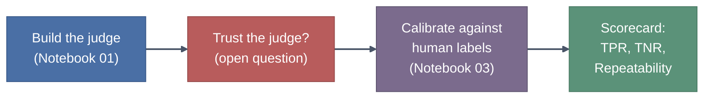

```mermaid
flowchart LR
    subgraph Phase1["Phase 1: Programmatic"]
        direction LR
        Q1["9 hardcoded\nquestions"] --> M1["Model (no context)"] --> V1["String match\nvs ground truth"]
    end

    subgraph Phase2["Phase 2: RAG + Judge"]
        direction LR
        Q2["6 questions\nwith context"] --> M2["Claude Sonnet 5\n(with RAG)"] --> J["LLM Judge\n(5 criteria,\nbinary verdict)"]
    end

    subgraph Phase3["Phase 3: Scale"]
        direction LR
        S["1000 synthetic\nsamples"] --> VIZ["5 matplotlib\nvisualizations"]
    end

    Phase1 --> |"~33% pass rate\nModel needs context"| Phase2
    Phase2 --> |"6 evaluated.\nDoes it hold at\n1000?"| Phase3

    style Q1 fill:#4A6FA5,stroke:#3A5A8A,color:#fff
    style M1 fill:#4A6FA5,stroke:#3A5A8A,color:#fff
    style V1 fill:#4A6FA5,stroke:#3A5A8A,color:#fff
    style Q2 fill:#C17C4E,stroke:#A0663D,color:#fff
    style M2 fill:#C17C4E,stroke:#A0663D,color:#fff
    style J fill:#C17C4E,stroke:#A0663D,color:#fff
    style S fill:#5B9279,stroke:#4A7A64,color:#fff
    style VIZ fill:#5B9279,stroke:#4A7A64,color:#fff

    linkStyle default stroke:#4A5568,stroke-width:2px
```

```mermaid
flowchart LR
    subgraph Build["Build"]
        direction LR
        A["Define failure mode:\nFactual Accuracy"] --> B["Write judge prompt\n(v1)"]
    end

    subgraph Split["Split"]
        direction LR
        C["36 labeled examples\n(judge_benchmark.jsonl)"] --> D["5 few-shot\n18 dev / 13 test"]
    end

    subgraph Calibrate["Calibrate"]
        direction LR
        E["Run v1 on dev\n94.4% accuracy"] --> F["Analyze\ndisagreements"] --> G["Write v2 prompt\n100% dev accuracy"]
    end

    subgraph Validate["Validate"]
        direction LR
        H["Run v2 on test\n92.3% accuracy"] --> I["Repeatability:\n5x3 = 100%"] --> J["Bias checks:\n0/3 flips"]
    end

    Build --> Split --> Calibrate --> Validate

    style A fill:#4A6FA5,stroke:#3A5A8A,color:#fff
    style B fill:#4A6FA5,stroke:#3A5A8A,color:#fff
    style C fill:#C17C4E,stroke:#A0663D,color:#fff
    style D fill:#C17C4E,stroke:#A0663D,color:#fff
    style E fill:#7B6B8D,stroke:#5F5570,color:#fff
    style F fill:#B85C5C,stroke:#964A4A,color:#fff
    style G fill:#7B6B8D,stroke:#5F5570,color:#fff
    style H fill:#5B9279,stroke:#4A7A64,color:#fff
    style I fill:#5B9279,stroke:#4A7A64,color:#fff
    style J fill:#5B9279,stroke:#4A7A64,color:#fff

    linkStyle default stroke:#4A5568,stroke-width:2px
```

# Quality Metrics - Trainer's Guide: Building and Calibrating LLM Judges

## At a Glance

| Item | Detail |
|------|--------|
| **Notebooks** | `01_LLM_as_Judge_analysis.ipynb` (build a judge), `03_Evaluating_your_Judge.ipynb` (calibrate the judge) |
| **Prerequisites** | Bedrock access (Claude Sonnet 5), Python 3.10+, `city_pop.csv` and `judge_benchmark.jsonl` in the working directory |
| **Key Takeaway** | An LLM judge you haven't calibrated against human labels is just another model guessing. Build the judge first, then prove it works before trusting it at scale. |

---

## The Real-World Hook: The Restaurant Health Inspector

Before opening notebooks, tell this story:

> "Imagine a city hires a health inspector to grade restaurants. She visits 6 places, gives each a rating, and the city publishes the results. Sounds reasonable. Now imagine someone asks: who inspected the inspector? Has anyone checked whether she grades consistently? Does she give higher scores to restaurants with nicer tablecloths, even when the kitchen is dirty? That's the arc of this module. Notebook 01 builds the inspector. Notebook 03 audits the inspector. You need both, because an uncalibrated judge is just another opinion you can't verify."

---

## Module Progression

```mermaid
flowchart LR
    subgraph NB1["Notebook 01: LLM-as-Judge Analysis"]
        direction LR
        A["Programmatic tests\n(no context)"] --> B["Add RAG context"] --> C["Multi-criteria\njudge (5 criteria)"] --> D["Scale simulation\n(1000 samples)"]
    end

    subgraph NB2["Notebook 03: Evaluating Your Judge"]
        direction LR
        E["Define one\nfailure mode"] --> F["Calibrate on\ndev set"] --> G["Iterate prompt\n(v1 to v2)"] --> H["Validate on\nheld-out test set"]
    end

    NB1 --> |"But can you\ntrust the judge?"| NB2

    style A fill:#4A6FA5,stroke:#3A5A8A,color:#fff
    style B fill:#C17C4E,stroke:#A0663D,color:#fff
    style C fill:#7B6B8D,stroke:#5F5570,color:#fff
    style D fill:#5B9279,stroke:#4A7A64,color:#fff
    style E fill:#4A6FA5,stroke:#3A5A8A,color:#fff
    style F fill:#C17C4E,stroke:#A0663D,color:#fff
    style G fill:#7B6B8D,stroke:#5F5570,color:#fff
    style H fill:#5B9279,stroke:#4A7A64,color:#fff

    linkStyle default stroke:#4A5568,stroke-width:2px
```

The transition between notebooks is the crux of this module. Notebook 01 gets participants building and running a judge quickly, generating dashboards and confidence intervals. It feels like a complete solution. Notebook 03 pulls the rug: "You measured 91.7% pass rate. How do you know the judge is right?" That question drives the entire second half.

---

## Notebook 1: LLM-as-Judge Analysis

### Real-World Hook

> "Think about how you'd audit an employee's work. First you check a few pieces yourself, by hand: did they get the numbers right? That's programmatic testing. Then you realize you can't check 1,000 pieces manually, so you hire a senior reviewer. That's LLM-as-Judge. But you don't hand over your entire QA process on day one; you start small, build trust, and then scale. This notebook follows that exact arc."

### Architecture Visual

### Say Before They Run

> "This notebook has three phases, and I want to flag something important about the third one. The first phase runs 9 questions against the model with no context - expect about a third to pass. The second phase adds context via RAG and uses an LLM judge to evaluate responses. The third phase generates 1,000 data points for visualization, but here's what you need to know: those 1,000 samples are synthetic. The notebook models realistic failure rates per question type instead of making 1,000 Bedrock calls. So when you see charts with a thousand data points, that's simulated scale, not live inference. The learning objective is reading confidence intervals and spotting question types that underperform, not burning through your Bedrock quota."

### Key Concepts to Explain

| Concept | Explanation |
|---------|-------------|
| **Programmatic testing first** | Before bringing in any LLM judge, run deterministic checks. If you can verify correctness with string matching or numerical comparison, do that. It's cheaper, faster, and has zero variance. The judge only earns its place for things code can't check. |
| **RAG grounding** | The model goes from ~33% to >90% just by receiving the relevant CSV row as context. This is the most dramatic slide in the module. Point at it and say: "This is why retrieval quality matters more than model selection for factual tasks." |
| **Binary verdicts over rating scales** | The notebook uses PASS/FAIL, not 1-5. Rating scales feel more informative but they hide failure modes. A "3 out of 5" tells you nothing actionable. A FAIL with reasoning tells you exactly what broke. Notebook 03 goes deeper on why. |
| **Multi-criteria judge prompt** | The judge in `utils.py` checks 5 things at once (accuracy, calculations, geography, depth, data handling). This works for a quick sweep, but notebook 03 will show why single-criterion judges are more reliable. Plant that seed here. |
| **Confidence intervals** | The scale simulation produces 95% CIs per question type. Teach participants to read the error bars: if two question types' intervals don't overlap, the difference is real. If they overlap, you can't claim one is worse. |
| **Question type classification** | The judge assigns each response a type (factual_lookup, ranking_comparison, calculation_based, etc.). This lets you slice performance by category and find which tasks your model is weak at, rather than treating all failures as a single number. |

### Gotchas to Pre-empt

- **Bedrock throttling with 20 participants:** The RAG section makes 6 Bedrock calls with 1-second sleeps. The judge section uses ThreadPoolExecutor with 3 workers. If the whole room hits Bedrock simultaneously, you'll see throttling errors. Stagger start times or have participants run in small waves.
- **"Why is my pass rate different from the slides?"** The programmatic tests compare against exact ground truth from `city_pop.csv`. Model responses vary between runs, so the pass rate floats. Tell them the exact number doesn't matter; the pattern (low without context, high with context) is the point.
- **Scale section confusion:** Participants sometimes think the 1,000-sample charts represent real Bedrock evaluations. They don't. The notebook generates synthetic data with hardcoded failure rates (ranking_comparison 18%, creative_writing 12%, factual_lookup 5%, etc.). Mention this before they run those cells, not after.
- **The judge prompt lives in utils.py:** Participants looking at the notebook won't see the full judge prompt inline. They need to open `utils.py` (or run the cell that prints a preview) to see the 5 criteria and the XML tag structure. Point them there early.
- **Saved output files:** The notebook writes `cities_evaluation_results.json` and `cities_evaluation_summary.csv` to the working directory. In a shared environment, 20 people writing the same filenames can cause confusion. SageMaker notebooks isolate user directories, but verify this before the session.

---

## Notebook 2: Evaluating Your Judge

### Real-World Hook

> "You've all taken a test where you thought the grading was unfair. Maybe the rubric was vague, or the grader seemed inconsistent. Now imagine that grader is an LLM, and it's grading 10,000 responses per day in production. If it has a blind spot, say, it always passes confident-sounding wrong answers, that blind spot scales to 10,000 wrong grades per day. This notebook is about catching those blind spots before you deploy. We treat the judge like any other model: give it labeled data, measure its accuracy, and fix what's broken."

### Architecture Visual

### Say Before They Run

> "This notebook does NOT use utils.py. It's fully self-contained, builds its own Bedrock client, and defines its own judge prompt from scratch. That's deliberate: we're building a judge the right way, from first principles. You'll make about 80 Bedrock calls total across all cells, so it's heavier than notebook 01. The most important cell is the one that shows disagreements between the judge and human labels. When you see Fort Worth, stop and read the reasoning carefully. That single example drives the entire v2 rewrite. If you skip past it, the rest of the notebook loses its thread."

### Key Concepts to Explain

| Concept | Explanation |
|---------|-------------|
| **TPR and TNR** | True Positive Rate = "of the responses humans said should pass, how many did the judge pass?" True Negative Rate = "of the responses humans said should fail, how many did the judge fail?" A judge that says PASS to everything has 100% TPR and 0% TNR. You need both numbers. |
| **Split by question, not by row** | The benchmark has 36 examples, but some questions appear with different response variants. If you split randomly by row, the same question can land in both few-shot and test. The judge then pattern-matches from context instead of evaluating independently. Splitting by unique question prevents this contamination. This is data leakage prevention, applied to eval data rather than training data. |
| **Dev set vs. test set discipline** | You iterate on the dev set. You run the test set exactly once, at the end. If test performance is bad, you collect new labeled data and start over. You never tune on the test set. This mirrors ML evaluation hygiene, and it's the same reason you don't study from the answer key. |
| **Disagreement analysis** | The v1 judge passes Fort Worth's "about 920,000" for an actual population of 918,915. The human labels it FAIL because a specific rounded number misrepresents the data. This single disagreement reveals that the rubric was ambiguous about rounding, and the v2 prompt adds explicit edge cases. One well-understood disagreement teaches you more than 100 agreements. |
| **One failure mode per judge** | Notebook 01's judge checks 5 criteria at once. This notebook builds a judge for Factual Accuracy alone, then adds a second judge for Completeness. When the Memphis test disagreement shows up, it's a Completeness issue, not an Accuracy issue. Separate judges let you pinpoint which dimension failed. Combined judges blur the signal. |
| **Repeatability** | Run the same 5 examples through the judge 3 times. If any verdict flips, the judge is unreliable. 100% repeatability here means the judge's behavior is deterministic enough for production use. A judge that gives different answers on the same input is useless regardless of its accuracy. |
| **Bias testing** | Three perturbation tests: add verbosity (long-winded but same facts), add confidence language ("I am absolutely certain" on a wrong answer), add markdown formatting. If any of these flip the verdict, the judge is responding to surface features rather than content. Zero flips here means the judge is robust. |

### Gotchas to Pre-empt

- **The Fort Worth disagreement is THE teaching moment.** If you gloss over it, the v2 prompt rewrite feels arbitrary. Stop the room. Show the numbers: 918,915 actual vs. 920,000 in the response. Ask: "Is that close enough?" Let them debate before revealing the human label. The disagreement between "reasonable approximation" and "specific wrong number" is exactly the kind of ambiguity that breaks judges in production.
- **~80 Bedrock calls total.** Dev evaluation (18 calls), v2 dev re-evaluation (18 calls), test evaluation (13 calls), repeatability (15 calls), completeness judge (10 calls), bias checks (6 calls). With 20 participants, that's ~1,600 calls hitting the account. Pre-check the account's calls-per-minute limit for your judge model.
- **The benchmark split is seeded (RANDOM_SEED=42).** Everyone gets the same 5/18/13 split. This is good for teaching (everyone sees the same Fort Worth disagreement) but means you can't use different participants' results to discuss split variance.
- **Memphis test disagreement:** The test set shows one disagreement on "Tell me about Memphis" where the human labels it FAIL (for completeness) but the Factual Accuracy judge says PASS. This is correct behavior: the judge is evaluating accuracy, not completeness. Use this to reinforce why you need separate judges for separate failure modes.
- **Self-contained notebook:** Participants coming from notebook 01 may try to import from utils.py. This notebook intentionally avoids that dependency. If someone asks why, the answer is pedagogical: building the judge from scratch makes every design decision visible.
- **The legal system analogy cell:** Some participants will skip the markdown cell with the legal analogy table. It's the conceptual scaffold for the entire notebook. If you see people jumping straight to code, pull them back and walk through the table row by row.

---

## Delivery Strategy Summary

| Notebook | Delivery Mode |
|----------|---------------|
| **01: LLM-as-Judge Analysis** | **Guided walkthrough with pauses.** Run Sections 1-2 (setup) quickly. Pause before the programmatic test results and ask: "What pass rate do you expect without context?" Let them guess, then run. At the RAG transition, explain WHY models struggle with numbers (conflicting training data, tokenization). Run the judge section live. For the scale simulation, run the cells but spend the time on chart interpretation, not execution. Ask: "Which question type would you fix first, and why?" |
| **03: Evaluating Your Judge** | **Interactive with structured stops.** Run setup and philosophy sections to set context. At the dev set results, stop and project the confusion matrix. Ask: "Is 94.4% good enough to ship?" Then reveal the Fort Worth disagreement and let the room discuss. After the v2 rewrite, have participants compare the two prompts side by side; ask them to identify exactly what changed. Run the test set as a reveal moment. The repeatability and bias sections are quick confirmations; don't linger unless results are surprising. Close with the scorecard and connect forward to Module 03 (understanding failures). |

---

## Quick Module Check - Audience Q&A

| # | Ask the Room | Expected Answer |
|---|-------------|-----------------|
| 1 | "Why did the model score ~33% without context but >90% with context?" | LLMs don't memorize precise numbers from training data. Conflicting sources, tokenization issues, and data staleness mean the model guesses. RAG grounds it in a specific, authoritative source. |
| 2 | "The scale simulation shows 91.7% pass rate. Is the system ready for production?" | You can't answer that without knowing if the judge itself is accurate. A 91.7% pass rate from a judge with 60% accuracy means nothing. That's why notebook 03 exists. |
| 3 | "Why binary pass/fail instead of a 1-5 scale?" | Scales introduce implicit variation. One person's 3 is another's 4. When you aggregate scores, you can't tell if a drop from 3.8 to 3.5 means more failures or just calibration drift. Binary verdicts give you a clean count: X% pass, Y% fail. You can inspect every fail. |
| 4 | "What changed between the v1 and v2 judge prompt?" | v1 said "approximate values are acceptable." v2 added explicit edge cases: "'approximately 2.4 million' for 2,390,125 is PASS" but "'920,000' for 918,915 is FAIL." The distinction is between a descriptive approximation and a specific wrong number. |
| 5 | "Why split the benchmark by question instead of by row?" | Same question can appear with different failure modes. If the question appears in both few-shot and test, the judge can pattern-match from context rather than evaluate independently. Splitting by question prevents data leakage. |
| 6 | "The test set accuracy dropped from 100% (dev) to 92.3%. Is the judge broken?" | No, that's expected. Dev set accuracy is inflated because you tuned the prompt against it. Test set accuracy is the honest number. 92.3% with 100% TPR means the judge catches every real pass. The 86% TNR means it misses some real fails (like the Memphis completeness issue). If those numbers are unacceptable, collect more labeled data and iterate, but never re-tune on the test set. |
| 7 | "Why build two separate judges instead of one judge that checks everything?" | A multi-criteria judge produces a blended verdict where you can't isolate which criterion failed. The Memphis example proves this: the Factual Accuracy judge correctly says PASS (the numbers are right) while the Completeness judge would say FAIL (the response doesn't fully answer the question). One combined judge would give you a verdict you can't debug. |

---

## Cheat Sheet: Common Participant Questions

| Question | Answer |
|----------|--------|
| "Can I use GPT-4 as the judge instead of Claude?" | Yes, the methodology is model-agnostic. The calibration workflow (benchmark, split, dev/test, repeatability) applies regardless of which model serves as judge. The key is calibrating whichever model you choose against human labels before trusting it. |
| "How many labeled examples do I need for a real project?" | Start with 30-50 per failure mode. That gives you enough for a meaningful dev/test split. Scale to 100+ if you need tight confidence intervals. The 36 examples here are a teaching minimum, not a production recommendation. |
| "What if my judge and humans disagree on 20% of cases?" | That's your signal. Analyze every disagreement. If the pattern is consistent (judge always too lenient on rounding, for example), refine the prompt. If disagreements are random, consider whether your human labels are consistent or whether the task is genuinely ambiguous. |
| "Why not use the LLM to generate the benchmark labels?" | Because then you're calibrating the judge against itself. The entire point is measuring whether the judge agrees with human judgment on known cases. If both the labels and the judge come from the same model, you're measuring self-consistency, not accuracy. |
| "The scale simulation in notebook 01 uses synthetic data. Is that useful?" | It teaches you how to read the output (confidence intervals, question type breakdowns, rolling pass rates) without burning through Bedrock quota. In production, you'd run these charts on real judge verdicts. The interpretation skills transfer directly. |
| "How often should I re-calibrate the judge?" | After any model change (new judge model version), any prompt change, or when you notice the judge's verdicts drifting from human spot-checks. Monthly spot-checks of 10-20 random verdicts against human review is a practical production cadence. |
| "What about inter-annotator agreement for the human labels?" | Great instinct. In production, have at least two humans label each example independently, and measure their agreement (Cohen's kappa). For this workshop the labels are pre-made, but the principle is: your benchmark is only as good as your labelers agree. |
| "Notebook 03 only tests 3 bias types. What about other biases?" | Position bias (first option in a list gets higher scores), sycophancy bias (judge agrees with confident assertions), length bias (penalizing short correct answers). The 3 tests here are a starting template. Extend them based on what your domain's common failure modes look like. |
