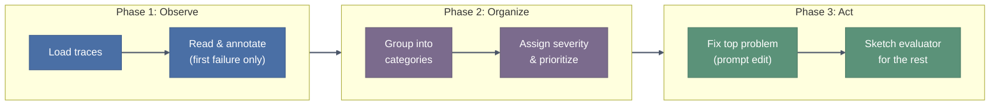
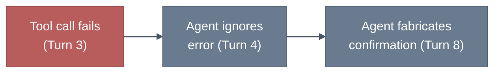
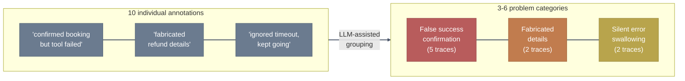
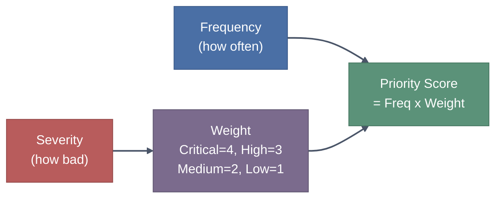
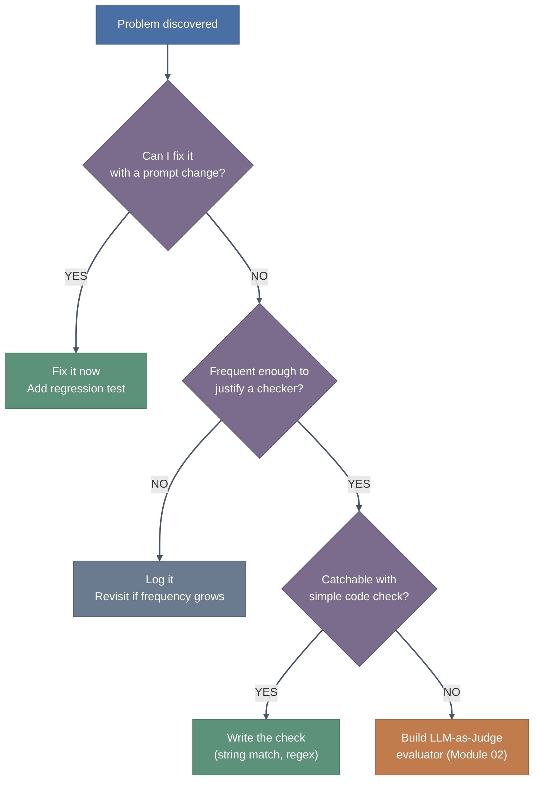
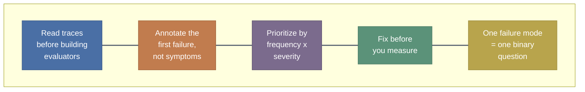

# Trainer Notes: 03 Understanding Failures

> **Audience:** Workshop trainers delivering Module 03 (Understanding Failures).
> One notebook in this section: `01_Discovering_Failure_Patterns.ipynb`.

---

## Why This Module Matters (Say Before They Run)

Open with this framing before anyone touches the notebook:

> "Modules 01 and 02 taught you how to measure things. This module answers the question that comes before measurement: *what should you measure?* If you build evaluators before reading your traces, you will spend days calibrating a judge for the wrong problem. We are going to read agent conversations, find what breaks, and only then decide what to automate."

This is the module where participants shift from "run the code, read the output" to "read the data, form a judgment." The notebook is designed to slow them down on purpose. Lean into that.

---

## Notebook: 01_Discovering_Failure_Patterns

### Module Flow

### Section-by-Section Delivery

#### Section 1-2: Loading Data & Reviewing Traces (Cells 3-33)

**Time estimate:** 25-30 minutes

**Setup cells (3-6):** Quick run-through. The data is 100 synthetic restaurant booking traces. Show Trace 1 on screen and walk through it line by line. Point out the tool error in Turn 3 and the false confirmation in Turn 8. Ask participants: *"What went wrong here?"*

**Key teaching moment (cell 11 -- "Focus on the first failure"):**

> Say: "When you read a trace, you will be tempted to flag every problem. Resist that. Write down the *first* thing that broke. Everything after a tool error is usually a consequence. If you fix the root, the downstream symptoms disappear."

> Say: "The red node is what you write in your note. The grey nodes are symptoms. If you annotate the symptoms instead of the root, your categories will be scattered and your fixes won't stick."

**Traces 1-3 (cells 14-19):** These have pre-filled example notes. Use them to calibrate expectations. Read each note aloud and ask: *"Is this specific enough? Could someone who hasn't seen the trace understand what failed?"*

**Traces 4-10 (cells 20-33):** LLM suggests a note for each. This is where participants should engage. Two ways to run this:

- **Interactive (recommended):** Have participants read the trace *first*, write their own note on paper or in a text cell, then run the LLM suggestion and compare. Discuss disagreements.
- **Time-pressed:** Run the LLM suggestions, but pause after each one and ask: *"Do you agree with this? What would you change?"*

**Common participant confusion:** "The LLM already labeled it, why do I need to read it?" Address this head-on:

> Say: "The LLM hasn't seen the trace as a conversation. It processed tokens. It doesn't know what matters to your business. In 3 of these 7 traces, the LLM's note is subtly wrong or misses the real root cause. If you accepted them all blindly, your categories would inherit those errors."

---

#### Section 3: Grouping Problems (Cells 35-42)

**Time estimate:** 15 minutes

**Core concept:** Individual notes become actionable categories.

**Teaching the "good name" test (cell 41):** This is a checkpoint participants tend to rush past. Stop and make them evaluate names.

> Say: "Read your category name out loud. If a new team member who has never seen a trace hears it, do they know exactly what to look for? 'Bad response' fails that test. 'Agent confirms action succeeded when the tool call failed' passes it."

**Run a quick exercise:** Write two category names on screen, one vague and one specific. Ask participants to vote on which is more actionable.

| Vague (unusable) | Specific (actionable) |
|---|---|
| "Error handling issue" | "Agent silently proceeds after tool error without informing user" |
| "Wrong information" | "Agent fabricates booking details not present in any tool response" |

---

#### Section 4: Prioritizing (Cells 44-51)

**Time estimate:** 10 minutes

**The priority formula:**

**Severity calibration (cell 46 table):** Walk through the four levels slowly. Participants often under-rate severity because they're looking at synthetic data.

> Say: "In production, 'Agent confirms a booking that never happened' means a real customer shows up at a restaurant with no table. That's not 'High', that's 'Critical'. Calibrate severity against what happens to a real user, not how interesting the bug is technically."

**Expected output from the notebook:** If participants used the LLM-generated categories, the top priority will be "Agent claims action succeeded despite explicit tool failure" at Critical severity with 5 occurrences (score = 20). This is by design; the next section fixes exactly this.

---

#### Section 5: Fix the Top Problem (Cells 53-61)

**Time estimate:** 20 minutes

**This is the "aha" section.** The payoff for all the reading and grouping work.

**The prompt gap (cells 54-55):** Display the original system prompt on screen. Ask participants to spot the gap before revealing it.

> Say: "Read this prompt. It tells the agent to be polite, collect info, use tools, confirm with the customer. Now tell me: what does it say about tool failures?" (Pause.) "Nothing. Zero instructions. So the agent does what LLMs do by default: it fills in the gap with confident, plausible, wrong text."

**The fix (cell 57):** Four sentences added to the system prompt. That's it.

```mermaid
flowchart LR
    subgraph Before["Original prompt"]
        direction LR
        B1["Be polite"] ~~~ B2["Collect info"] ~~~ B3["Use tools"] ~~~ B4["Confirm details"]
    end

    subgraph After["Improved prompt"]
        direction LR
        A1["Be polite"] ~~~ A2["Collect info"] ~~~ A3["Use tools"] ~~~ A4["Confirm details"] ~~~ A5["Handle errors\nhonestly"]
    end

    Before --> |"+4 sentences"| After

    style B1 fill:#4A6FA5,stroke:#3A5A8A,color:#fff
    style B2 fill:#4A6FA5,stroke:#3A5A8A,color:#fff
    style B3 fill:#4A6FA5,stroke:#3A5A8A,color:#fff
    style B4 fill:#4A6FA5,stroke:#3A5A8A,color:#fff
    style A1 fill:#4A6FA5,stroke:#3A5A8A,color:#fff
    style A2 fill:#4A6FA5,stroke:#3A5A8A,color:#fff
    style A3 fill:#4A6FA5,stroke:#3A5A8A,color:#fff
    style A4 fill:#4A6FA5,stroke:#3A5A8A,color:#fff
    style A5 fill:#5B9279,stroke:#4A7A64,color:#fff

    linkStyle default stroke:#4A5568,stroke-width:2px
```

> Say: "This fix took 5 minutes. Compare that to building an LLM-as-Judge evaluator for the same problem: writing the judge prompt, collecting labeled examples, calibrating agreement scores, running it in CI. That's days of work to *detect* something we just *eliminated*. The decision flowchart matters: fix first, evaluate what survives."

**Persona simulation (cells 58-61):** This replays the original conversation against the improved agent. The simulated user follows the original script. It's slow (multiple Bedrock calls). **Pre-run this cell before the session** or have a screenshot of the output ready.

> Say: "Watch what happens at the tool error turn. The original agent said 'your table is confirmed.' The improved agent says 'I'm sorry, I wasn't able to complete your reservation due to a system issue.' Same tool error, different prompt, completely different outcome."

---

#### Section 6: Bridge to Evaluator Design (Cells 64-68)

**Time estimate:** 10 minutes

**The decision flowchart (cell 52):** This is the single most reusable artifact in the module. Make sure every participant internalizes it.

> Say: "LLM-as-Judge is the most expensive option on this tree. It's powerful, but it's the last resort, not the first move. You should arrive at that box only after confirming you can't fix the problem and you can't catch it with a simple check."

**Binary question writing (cell 66):** Emphasize the quality bar.

> Say: "Your binary question has to pass one test: if two people read the same trace, would they give the same yes/no answer? 'Was the agent helpful?' fails. 'Did the agent fabricate details not present in any tool response?' passes. Specificity is what makes a judge reliable."

**Quick judge test (cell 68):** Runs the judge against 3 traces. All return FAIL with clear reasoning. Use this to show participants that a well-written binary question produces consistent, explainable verdicts.

---

## Key Takeaways to Reinforce

Summarize the module with these five points. Consider putting them on a closing slide.

1. **Read before you build.** You can't measure what you don't understand. Reading 10 traces teaches you more than building 10 evaluators for the wrong thing.
2. **Annotate root causes, not symptoms.** The first failure in a trace is usually the one worth fixing. Everything downstream is collateral.
3. **Prioritize with math, not gut feel.** Frequency x severity gives you a defensible priority list that a team can align on.
4. **Fix before you measure.** A 5-minute prompt edit that eliminates a failure mode beats a week of evaluator calibration that only detects it.
5. **One failure = one binary question.** When you do need an evaluator, keep it focused. Multi-criteria judges produce inconsistent verdicts.

---

## Connections to Other Modules

Use these bridges when transitioning between modules:

| From/To | Bridge |
|---|---|
| **Module 01 (Operational Metrics) to here** | "Module 01 showed you anomalies in latency and token counts. Those anomalies tell you *where* to look. This module teaches you *what* to look for when you get there." |
| **Here to Module 02 (Quality Metrics)** | "You just wrote a binary question and sketched a judge prompt. Module 02 teaches you how to calibrate that judge: labeled test sets, agreement scores, the full scorecard." |
| **Here to Module 04 (Agentic Metrics)** | "These same restaurant traces appear in Module 04. The problem categories you built here become the metrics you track there. You'll see the same agent, the same failures, measured at scale." |

---

## Common Q&A

**Q: "How many traces should I review in production?"**
The notebook reviews 10. In production, aim for at least 100 to get a representative sample. Start with traces that have high latency, tool errors, or user complaints. Random sampling works once you've covered the known-bad cases.

**Q: "Should I use the LLM-generated categories or write my own?"**
Use the LLM suggestions as a starting point, then edit aggressively. The LLM tends to create too many categories and give them overly generic names. Merge similar ones, rename vague ones, and delete categories with only one trace unless the severity is Critical.

**Q: "What if my traces don't have obvious tool errors like these?"**
The restaurant booking agent has dramatic failures (tool error + false confirmation) because it's a teaching example. Real-world failures are subtler: wrong tool selected, correct tool but wrong parameters, correct response but poor tone, technically correct but unhelpful. The same methodology applies; you just need sharper observation skills, which is why the notebook trains that muscle.

**Q: "How often should we repeat this process?"**
Weekly, by one person who owns the problem list. The notebook's closing advice is serious: 30 minutes of trace review per week catches more issues than an automated pipeline nobody monitors. Re-run the full prioritization exercise after any prompt change, model switch, or new tool addition.

**Q: "Can I automate the annotation step entirely with an LLM?"**
You can, but you shouldn't skip human review. LLM-generated annotations are fluent and confident even when wrong. The notebook demonstrates this: some of the LLM suggestions miss the actual root cause or describe a downstream symptom instead. Use LLM suggestions to speed up annotation, but always verify.

---

## Timing Guide

| Section | Cells | Estimated Time | Notes |
|---|---|---|---|
| Setup & data loading | 3-6 | 5 min | Quick run-through |
| Trace review & annotation | 8-33 | 25-30 min | Core hands-on section; slow down here |
| Grouping | 35-42 | 15 min | Discuss category naming quality |
| Prioritization | 44-51 | 10 min | Severity calibration is key |
| Prompt fix & replay | 53-61 | 20 min | Pre-run cell 61; this is the "aha" moment |
| Evaluator bridge | 64-68 | 10 min | Connects forward to Module 02 |
| **Total** | | **~90 min** | |

---

## Trainer Preparation Checklist

- [ ] Pre-run all cells in the notebook (especially cell 61, the persona simulation replay, which takes several minutes)
- [ ] Have screenshots of cell 61's comparison output ready in case Bedrock is slow during the live session
- [ ] Verify Bedrock access in the target account (`us.anthropic.claude-sonnet-5` must be enabled)
- [ ] Read through all 10 traces yourself and form your own notes before the session; you'll need to challenge participants who accept LLM suggestions uncritically
- [ ] Prepare one real-world example of a "hallucinated success" failure from your own experience (or a published incident) to make the teaching moment concrete
