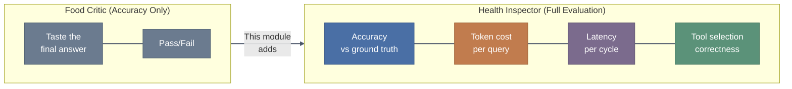
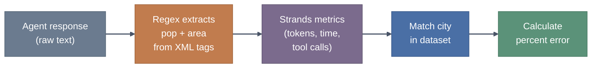

# Agents Evaluation Framework - Trainer's Guide: From Single-Agent Baselines to Meta-Evaluation Orchestration

> **Audience:** Workshop trainers delivering Module 04 (Agentic Metrics).
> One notebook in this section: `01-Agentic-Metrics.ipynb`.

## At a Glance

| Item | Detail |
|------|--------|
| **Notebooks** | `01-Agentic-Metrics.ipynb` (13 sections, ground truth through advanced metrics) |
| **Prerequisites** | Module 01 (operational metrics), Module 02 (quality metrics, LLM-as-Judge), Module 03 (failure patterns). Bedrock access for Nova Micro, Nova 2 Lite, Nova Pro, Claude Haiku 4.5, Claude Sonnet 5. AgentCore access for Section 11 code interpreter. |
| **Key Takeaway** | Accuracy alone is half the picture. Agentic systems need concurrent measurement of correctness, cost, latency, and tool selection, and the Strands SDK gives you all four out of the box. |

---

## The Real-World Hook: The Restaurant Health Inspector

Before opening notebooks, tell this story:

> "Think about a restaurant health inspector. They don't just taste the food. They check the kitchen temperature logs, watch how staff handle raw ingredients, time how long food sits under the heat lamp, and verify that the cleaning checklist is actually followed. A restaurant could serve a perfect meal while violating six health codes. Same thing with agents: the answer can be correct while the agent burned 50,000 tokens, made 12 unnecessary web searches, and took 45 seconds to respond. This module teaches you to be the health inspector, not just the food critic."

---

## Module Progression

```mermaid
flowchart LR
    subgraph Phase1["Ground Truth + Core Eval"]
        direction LR
        S1["Load city_pop.csv\n(347 cities)"] --> S2["evaluate_city_guess\n(XML parse + % error)"]
    end

    subgraph Phase2["Agent Building"]
        direction LR
        S3["web_search +\nget_page tools"] --> S4["Single agent\nbaseline (Nova Micro)"]
    end

    subgraph Phase3["Scaling Evaluation"]
        direction LR
        S5["eval_model tool\n(meta-agent pattern)"] --> S6["Multi-model +\nmulti-city comparison"]
    end

    subgraph Phase4["Tool + Judge Eval"]
        direction LR
        S7["Tool selection\naccuracy (20 cases)"] --> S8["LLM-as-Judge\n(binary pass/fail)"]
    end

    subgraph Phase5["Observability"]
        direction LR
        S9["metrics.get_summary\n(cycles, tokens, tools)"]
    end

    Phase1 --> |"WHY: Can't evaluate\nwithout a baseline"| Phase2
    Phase2 --> |"WHY: One model isn't\nenough to compare"| Phase3
    Phase3 --> |"WHY: Accuracy alone\nmisses tool correctness"| Phase4
    Phase4 --> |"WHY: Need production-\nready monitoring"| Phase5

    style S1 fill:#4A6FA5,stroke:#3A5A8A,color:#fff
    style S2 fill:#4A6FA5,stroke:#3A5A8A,color:#fff
    style S3 fill:#C17C4E,stroke:#A0663D,color:#fff
    style S4 fill:#C17C4E,stroke:#A0663D,color:#fff
    style S5 fill:#7B6B8D,stroke:#5F5570,color:#fff
    style S6 fill:#7B6B8D,stroke:#5F5570,color:#fff
    style S7 fill:#5B9279,stroke:#4A7A64,color:#fff
    style S8 fill:#5B9279,stroke:#4A7A64,color:#fff
    style S9 fill:#B8A44C,stroke:#9A8A3D,color:#fff

    linkStyle default stroke:#4A5568,stroke-width:2px
```

---

## Notebook 1: 01-Agentic-Metrics.ipynb

### Real-World Hook

> "In Module 01 you measured latency and tokens. In Module 02 you judged response quality. In Module 03 you found the failure patterns hiding in traces. Now you combine all three lenses and add something new: tool selection accuracy. This is the closest the workshop gets to a production evaluation pipeline."

### Architecture Visual

```mermaid
flowchart LR
    subgraph DataLayer["Data Layer"]
        direction LR
        CSV["city_pop.csv\n347 cities"] ~~~ DS["dataset.json\n20 tool test cases"]
    end

    subgraph AgentLayer["Agent Under Test"]
        direction LR
        WS["web_search\n(DuckDuckGo)"] ~~~ GP["get_page\n(BeautifulSoup)"] ~~~ CALC["calculate\n(safe eval)"]
    end

    subgraph EvalLayer["Evaluation Layer"]
        direction LR
        ECG["evaluate_city_guess\n(% error + metrics)"] ~~~ TSA["Tool selection\naccuracy checker"] ~~~ JUDGE["LLM-as-Judge\n(Claude Sonnet 5)"]
    end

    subgraph MetaLayer["Meta-Agent Orchestration"]
        direction LR
        EM["eval_model tool"] ~~~ EMM["eval_model_multi tool"] ~~~ META["Evaluator agent\n(Nova Micro)"]
    end

    DataLayer --> AgentLayer --> EvalLayer
    EvalLayer --> MetaLayer

    style CSV fill:#4A6FA5,stroke:#3A5A8A,color:#fff
    style DS fill:#4A6FA5,stroke:#3A5A8A,color:#fff
    style WS fill:#C17C4E,stroke:#A0663D,color:#fff
    style GP fill:#C17C4E,stroke:#A0663D,color:#fff
    style CALC fill:#C17C4E,stroke:#A0663D,color:#fff
    style ECG fill:#5B9279,stroke:#4A7A64,color:#fff
    style TSA fill:#5B9279,stroke:#4A7A64,color:#fff
    style JUDGE fill:#5B9279,stroke:#4A7A64,color:#fff
    style EM fill:#7B6B8D,stroke:#5F5570,color:#fff
    style EMM fill:#7B6B8D,stroke:#5F5570,color:#fff
    style META fill:#7B6B8D,stroke:#5F5570,color:#fff

    linkStyle default stroke:#4A5568,stroke-width:2px
```

### Say Before They Run

> "This notebook is the longest in the workshop and it hits Bedrock hard. Sections 1 through 8 are safe for everyone to run at once. Sections 9 and 10 fire off multiple model calls in parallel, so we'll stagger those. I'll call out when to pause. One more thing: Section 11 creates actual files on your disk and needs AgentCore access for the code interpreter. If that's not set up, don't worry, we'll demo that section live."

### Section-by-Section Delivery

#### Sections 1-3: Setup and Ground Truth (Cells 0-6)

Run these quickly. The interesting teaching moment is the dataset itself.

> Say: "347 US cities with population and land area. This is our answer key. Every number the agent produces gets compared against this CSV. Notice the data cleaning step: Wikipedia puts commas in numbers and bracket annotations on city names. If you skip the cleaning, your percent-error math breaks silently. This is a real-world pattern: ground truth data always needs scrubbing."

#### Section 4: Core Evaluation Function (Cell 8)

This is the backbone of the entire notebook. Walk through it line by line.

> Say: "This function does two things at once: it checks accuracy *and* extracts operational metrics. The accuracy check is the regex parsing XML tags from the agent's response. The operational check pulls tokens, time, and tool calls from the Strands metrics object. In production, you'd split these into separate collectors. Here they're combined to keep the notebook compact."

**Point out the fragility:** The regex expects `<pop>` and `<area>` XML tags with pure numbers inside. Weaker models frequently fail this. They'll add commas, write "approximately 8.4 million", or skip the tags entirely. When that happens, the function throws a `ValueError`. This is intentional: it demonstrates that structured output is a capability you have to evaluate, not assume.

#### Section 5: Agent Tools (Cell 10)

> Say: "Two tools: `web_search` and `get_page`. Notice `web_search` uses subprocess to call DuckDuckGo. Why not call the library directly? Isolation. If DDGS hangs or leaks memory, it dies in the subprocess, not in your agent process. The tradeoff is that error messages from subprocess failures are opaque. If search silently fails, the agent will either hallucinate an answer or admit it can't find data. Both are interesting evaluation outcomes."

#### Section 6: Bedrock Configuration (Cell 12)

Quick pass. The key insight is that timeout tuning is an evaluation design choice, not just an ops concern.

> Say: "The `quick_config` has zero retries and a 20-second read timeout. That's aggressive. In a production system you'd want retries. But for evaluation, you want the opposite: if a model can't respond in 20 seconds, you want that recorded as a failure, not masked by a retry that adds latency. The evaluation framework's config should be stricter than production, not more lenient."

#### Section 7: Single Agent Baseline (Cells 14-17)

This is the first live execution. **Expect it to fail** in the notebook output. The saved output shows the web search tool erroring out, Nova Micro returning `<pop>N/A</pop>`, and the evaluation function throwing a ValueError.

> Say: "Look at what just happened. Nova Micro couldn't use the web search tool successfully, so it admitted it couldn't find the data and put N/A in the XML tags. Our evaluation function crashed because it got N/A instead of a number. This is actually a *good* outcome for evaluation design: you've just learned two things. First, Nova Micro can't reliably drive web search tools. Second, your evaluation function needs better error handling for non-numeric XML content. Both are real findings."

**The callback handler** (cell 15) is worth a quick explanation. It shows streaming text plus tool calls as they happen. Participants find this useful for understanding what the agent is doing.

#### Section 8: Single Model Eval Tool (Cell 19)

> Say: "We just wrapped the evaluation into a Strands @tool. Why? Because we want an *agent* to call it. Think about that: a tool that evaluates an agent, callable by another agent. This is the setup for the meta-agent pattern coming next."

#### Section 9: Multi-Model Comparison - Meta-Agent Pattern (Cells 21-22)

**This is the conceptual highlight of the module.** Slow down here.

```mermaid
flowchart LR
    subgraph Outer["Evaluator Agent (Nova Micro)"]
        direction LR
        E["Receives model list\n+ instructions"]
    end

    subgraph Tool["eval_model tool"]
        direction LR
        T1["Creates inner agent\nwith target model"] --> T2["Runs city query"] --> T3["Returns metrics string"]
    end

    subgraph Models["Models Under Test"]
        direction LR
        M1["Nova Micro"] ~~~ M2["Nova 2 Lite"] ~~~ M3["Nova Pro"] ~~~ M4["Haiku 4.5"] ~~~ M5["Sonnet 5"]
    end

    Outer --> |"Calls for\neach model"| Tool
    Tool --> |"Tests"| Models

    style E fill:#7B6B8D,stroke:#5F5570,color:#fff
    style T1 fill:#C17C4E,stroke:#A0663D,color:#fff
    style T2 fill:#C17C4E,stroke:#A0663D,color:#fff
    style T3 fill:#C17C4E,stroke:#A0663D,color:#fff
    style M1 fill:#4A6FA5,stroke:#3A5A8A,color:#fff
    style M2 fill:#4A6FA5,stroke:#3A5A8A,color:#fff
    style M3 fill:#4A6FA5,stroke:#3A5A8A,color:#fff
    style M4 fill:#4A6FA5,stroke:#3A5A8A,color:#fff
    style M5 fill:#4A6FA5,stroke:#3A5A8A,color:#fff

    linkStyle default stroke:#4A5568,stroke-width:2px
```

> Say: "This is an agent whose only job is to evaluate other agents. It receives a list of model names, calls the eval_model tool for each one, handles failures with retries, and compiles a comparison table. The evaluator itself runs on Nova Micro, which is the cheapest option. You don't need a strong model to orchestrate tool calls in sequence. You need a strong model to *answer hard questions*. These are different jobs."

**Gotcha for the classroom:** This section fires 5+ Bedrock API calls in sequence. With 20 participants running simultaneously, that's 100+ concurrent calls. **Stagger execution.** Have half the room run while the other half watches, then swap. Or pre-run and show the output.

> Say: "Notice the evaluator prompt asks for retry logic: 'If a model fails to evaluate, retry up to 3 times.' The agent is implementing its own retry strategy. This is more flexible than hardcoding retries in the evaluation function, because the agent can adapt: it might try a different city, rephrase the prompt, or skip a model that keeps failing. Agentic evaluation orchestration gives you adaptability that a for-loop doesn't."

#### Section 10: Multi-City Evaluation (Cells 23-31)

Two new pieces: the `calculate` tool and multi-city random sampling.

> Say: "We've been testing one city per model. That's a sample size of one. You wouldn't ship a model comparison based on a single test case. This section samples 3 cities randomly per model and averages the errors. It also adds a calculator tool so the agent can do arithmetic without hallucinating math."

**Point out the `eval()` concern:** The calculator tool uses Python's `eval()` with a character whitelist. This is a teaching moment.

> Say: "Yes, this uses eval(). In production, never do this. The character whitelist mitigates injection but doesn't eliminate it. For a workshop notebook it's fine. In production, use a proper expression parser or a sandboxed code interpreter like the one in Section 11."

**Random sampling without a seed:** Results will differ between participants. Frame this as a feature, not a bug.

> Say: "Everyone's going to get different cities. That's intentional. Compare your results with your neighbor. If Nova Micro gets 2% error for New York but 40% for Philadelphia, that tells you something about the model's training data coverage. Inconsistency across cities is itself a metric worth tracking."

#### Section 11: Tool Call Evaluation (Cells 32-34)

**Completely different evaluation approach.** Make sure participants feel the shift.

> Say: "Everything up to now measured *answer accuracy*: was the population number close enough? Now we're measuring something different: *did the agent pick the right tool?* This is like testing whether a mechanic reaches for the right wrench, regardless of whether the bolt gets tightened correctly. Tool selection is a separate capability from answer quality, and you need to evaluate both."

The 20-case dataset spans 5 categories:

| Category | Count | Expected Tool |
|----------|-------|---------------|
| Math problems | 6 | calculator |
| File reading | 4 | file_read |
| File writing | 4 | file_write |
| Code execution | 4 | code_interpreter |
| General knowledge | 2 | none |

**Two critical env/config requirements:**

1. `BYPASS_TOOL_CONSENT=true` must be set or `file_write` calls hang waiting for user confirmation that never comes. The notebook sets this via `os.environ`.
2. `record_direct_tool_call=True` on the Agent constructor. Without it, `metrics.tool_metrics` is empty and the accuracy calculation breaks silently (0% accuracy for everything).

> Say: "These two flags are the kind of thing that costs you an hour of debugging if you miss them. The notebook sets them explicitly, but if you're building your own evaluation harness, put them in your checklist."

**Section 11 creates real files.** `hello.txt`, `core.txt`, `log.txt`, `status.txt` will appear in the notebook's working directory. Mention this so participants don't wonder where those came from.

**AgentCore dependency:** The `AgentCoreCodeInterpreter` requires AgentCore access. If participants don't have it, those 4 test cases (code_interpreter category) will fail. The accuracy percentage will be lower, but the rest of the evaluation still runs.

#### Section 12: LLM-as-Judge (Cell 36)

> Say: "We've come full circle. Module 02 taught you how to build an LLM-as-Judge. Module 03 taught you to write binary questions instead of rating scales. Now we're deploying that pattern here with four binary checks: Accuracy, Relevance, Completeness, Tool Usage. The judge is Claude Sonnet 5 evaluating the weaker model's responses. The overall verdict passes only if all four checks pass. This is deliberately strict."

Connect back to Module 02 notebook 03:

> Say: "Remember the reasoning from Module 02 about why binary verdicts beat rating scales? This is that principle in action. A 1-5 scale on 'Tool Usage' means nothing actionable. 'PASS: correct tool selected and used appropriately' or 'FAIL: used calculator when file_read was needed' is something you can act on immediately."

**This section is slow.** It runs 20 agent calls plus 20 judge calls. That's 40 Bedrock invocations per participant. Consider demoing this live rather than having everyone run it.

#### Section 13: Advanced Metrics Analysis (Cell 38)

> Say: "Everything we've been extracting manually from response.metrics, this function pulls out in one call. `get_summary()` gives you cycles, duration, per-tool stats with success rates, token breakdown, and latency. In production, you'd pipe this into CloudWatch or your observability stack. The Strands SDK exposes this natively; you don't have to build the instrumentation yourself."

Walk through the output fields:

| Metric | What It Tells You | Production Use |
|--------|-------------------|----------------|
| `total_cycles` | How many think-act loops the agent ran | Detect infinite loops, compare efficiency |
| `cycle_durations` | Time per loop iteration | Find slow tool calls dragging down the agent |
| `tool_metrics` (count, success rate, avg time) | Per-tool reliability | Identify flaky tools, optimize slow ones |
| `accumulated_usage` (input/output/total tokens) | Cost driver | Budget alerting, model cost comparison |
| `latencyMs` | End-to-end response time | SLA monitoring |

### Key Concepts to Explain

| Concept | Explanation |
|---------|-------------|
| **Ground truth validation** | You need a known-correct dataset to compute error. Without it, you're judging vibes. The city CSV is simple by design: population and area are verifiable numbers, not subjective quality. Pick ground truth data types where "correct" has exactly one answer. |
| **Structured output via XML tags** | Asking the agent to wrap answers in `<pop>` and `<area>` tags lets you extract numbers programmatically. This is a capability test in itself: weaker models fail to follow the format. When structured output fails, your evaluation pipeline fails, and that failure is data. |
| **Percent error** | `abs(actual - guessed) / actual * 100`. Normalizes across different magnitudes. A 50,000-person error on NYC (pop 8.4M) is 0.6%. The same absolute error on Boise (pop 235K) is 21%. Percent error makes cross-city comparison fair. |
| **Meta-agent pattern** | An agent that orchestrates other agents via tool calls. The evaluator agent doesn't know anything about cities; its only tool is `eval_model`. This separation of concerns means you can swap evaluation targets without touching the orchestrator. |
| **Tool selection accuracy** | Measures whether the agent chose the right tool, independent of answer quality. An agent can pick the right tool and still get a wrong answer (bad parameters), or pick the wrong tool and stumble into a correct answer (general knowledge). Both dimensions matter. |
| **Strands SDK observability** | `response.metrics` gives you `accumulated_usage`, `cycle_durations`, `tool_metrics`, and `get_summary()` out of the box. No custom instrumentation needed. This is the difference between Strands and rolling your own agent loop: the eval surface area comes for free. |
| **Binary LLM-as-Judge** | Four independent pass/fail checks (Accuracy, Relevance, Completeness, Tool Usage) instead of a single 1-5 score. Granular enough to diagnose *what* failed, but simple enough that judges stay consistent across runs. Overall verdict is AND logic: one failure means overall fail. |
| **Botocore config as eval design** | Strict timeouts and zero retries during evaluation are deliberate. You want to observe the real failure mode, not mask it behind retry logic. Production config should be more lenient; evaluation config should be more honest. |

### Gotchas to Pre-empt

- **DuckDuckGo rate limiting (Sections 7-10):** With 20 participants all running `web_search` concurrently, DDGS will throttle or block requests. Some agents will get "Search error" or "No search results found" and fall back to training data or admit failure. This is actually useful for showing how tool failures cascade, but warn participants so they don't think their setup is broken.
- **XML tag parsing failures (Sections 7-10):** Nova Micro frequently fails to produce clean XML tags. It adds commas, writes words instead of numbers, or skips tags entirely. The `evaluate_city_guess` function throws a ValueError. Tell participants this is expected and that XML compliance is itself an evaluation signal.
- **Section 9 Bedrock API load:** Five model evaluations per participant, sequential. With a full room, stagger execution or demo this section live. Consider having participants run only 2-3 models instead of all 5 if capacity is tight.
- **Section 10 random city selection:** No seed means different results per participant. Some will see great accuracy (they got easy cities), others will see terrible accuracy (they got cities with Wikipedia annotation quirks). Use the variance as a teaching moment about sample size.
- **Section 11 file creation:** The `file_write` test cases create real files (`hello.txt`, `core.txt`, `log.txt`, `status.txt`) in the working directory. Not harmful, but participants will notice new files appearing.
- **`BYPASS_TOOL_CONSENT` not set:** If someone skips cell 34's environment variable setup, `file_write` tool calls will hang indefinitely waiting for consent input that never arrives. The notebook handles this, but anyone running cells out of order will hit it.
- **`record_direct_tool_call` omitted:** Without `record_direct_tool_call=True` on the Agent constructor, `tool_metrics` is an empty dict. The tool selection accuracy check silently reports 0% for everything. This is a subtle bug that looks like a model failure but is actually a config issue.
- **AgentCoreCodeInterpreter access:** Section 11's code interpreter tests require AgentCore. If participants don't have access, those 4 test cases fail. The rest of the notebook still works. Mention this upfront so people don't spend time debugging access issues.
- **Section 12 is expensive:** 20 agent calls + 20 judge calls = 40 Bedrock invocations per participant. With Claude Sonnet 5 as the judge, token costs add up. Consider demoing this section live or having participants run a subset (first 5 cases).

---

## Delivery Strategy Summary

| Section | Delivery Mode |
|---------|---------------|
| Sections 1-4 (Setup, Ground Truth, Core Eval) | **Instructor-led walkthrough.** Run cells on the projector. Pause at `evaluate_city_guess` and trace the logic line by line. Participants follow along but don't need to run anything yet. |
| Section 5-6 (Tools, Bedrock Config) | **Quick run-through.** Have participants run these cells to set up their environment. Flag the subprocess pattern and timeout configs but don't dwell. |
| Section 7 (Single Baseline) | **Everyone runs together.** First live agent execution. Expect failures. Use failures as teaching moments about structured output and tool reliability. |
| Section 8 (Eval Tool) | **Conceptual bridge.** Explain the pattern: wrapping evaluation in a @tool so an agent can call it. Run the cell, but spend the time explaining *why*, not watching it execute. |
| Section 9 (Multi-Model Comparison) | **Staggered or demo.** Heavy API load. Split the room in half, or run it live on the projector while participants read the code. Discuss the meta-agent pattern during execution. |
| Section 10 (Multi-City) | **Staggered or demo.** Same API load concern. Have participants compare their random city selections with neighbors. Use variance to motivate larger sample sizes. |
| Section 11 (Tool Selection) | **Run together, with setup check.** Verify everyone has `BYPASS_TOOL_CONSENT` set and `record_direct_tool_call=True` before running. Demo the AgentCore code interpreter if some participants lack access. |
| Section 12 (LLM-as-Judge) | **Demo only.** Too expensive for 20 simultaneous runs. Run on projector, discuss the binary verdict design, connect back to Module 02. |
| Section 13 (Advanced Metrics) | **Everyone runs.** Quick, single Bedrock call. Walk through the output fields and discuss production observability. |

---

## Quick Module Check - Audience Q&A

| # | Ask the Room | Expected Answer |
|---|-------------|-----------------|
| 1 | "Why do we use percent error instead of absolute error for city population?" | Absolute error doesn't normalize for city size. A 50K error on NYC is trivial (0.6%), but the same error on a city of 200K is catastrophic (25%). Percent error makes cross-city comparison meaningful. |
| 2 | "The evaluator agent in Section 9 runs on Nova Micro, the cheapest model. Why not use Sonnet 5 for the orchestrator?" | The orchestrator's job is to call a tool repeatedly and compile results. It doesn't need reasoning power; it needs to follow instructions. Using the cheapest model for orchestration and reserving expensive models for the actual evaluation is a cost optimization pattern. |
| 3 | "What happens to your evaluation pipeline when a model doesn't produce valid XML tags?" | The pipeline crashes with a ValueError. That crash is data: it tells you the model can't follow structured output instructions. In production, you'd catch the error and record it as a format compliance failure rather than skipping the test case. |
| 4 | "Section 11 measures tool selection accuracy separately from answer accuracy. When would those diverge?" | A model can pick the right tool but pass wrong parameters (correct tool, wrong answer). Or it can skip the tool entirely and answer from training data (wrong tool, possibly correct answer). Measuring both dimensions independently reveals failure modes that a single accuracy metric hides. |
| 5 | "Why binary pass/fail in the judge instead of a 1-5 quality score?" | Binary verdicts are reproducible: two runs of the same judge on the same response usually agree. Rating scales drift between runs, invite middle-value hedging (everything gets a 3), and are harder to act on. "Failed the Accuracy check" is a clear signal. "Got a 3 out of 5 on Accuracy" is not. |

---

## Cheat Sheet: Common Participant Questions

| Question | Answer |
|----------|--------|
| "Why does web_search use subprocess instead of importing DDGS directly?" | Isolation. If the DuckDuckGo library hangs, crashes, or leaks memory, the subprocess dies without taking down the agent process. The tradeoff is opaque error messages. In production you'd use a proper sandboxed tool runtime (like AgentCore Gateway), but subprocess is a lightweight version of the same principle. |
| "The saved notebook output shows the baseline failing. Is the notebook broken?" | No, that's the point. Nova Micro with web search is deliberately unreliable. The failure demonstrates why you need evaluation in the first place: you can't know a model is unreliable until you test it systematically. |
| "Can I use a different ground truth dataset?" | Yes, and you should for your own use cases. The pattern is what matters: a CSV with known-correct values, a prompt that demands structured output, and an evaluation function that computes error against the ground truth. Swap city populations for product prices, API response times, or any domain where you have a verifiable answer. |
| "What's the cost of running this entire notebook?" | The heaviest sections are 9, 10, and 12. Section 9 runs 5 model evaluations (each with web search tool calls). Section 10 runs 2 models x 3 cities. Section 12 runs 40 Bedrock calls (20 agent + 20 judge). For a single participant, expect a few dollars in Bedrock charges total. With 20 participants running everything, that scales linearly. |
| "Why not just use accuracy and skip all the operational metrics?" | Because in production, a model that's 98% accurate but costs 10x more tokens and takes 3x longer than a 95% accurate alternative is the wrong choice. Operational metrics (tokens, latency, tool calls) drive cost and user experience. Accuracy is necessary but not sufficient. |
| "The calculator tool uses eval(). Isn't that dangerous?" | Yes. The character whitelist mitigates the worst injection vectors, but eval() is fundamentally unsafe. This is a workshop shortcut. In production, use a sandboxed expression evaluator or the AgentCore code interpreter shown in Section 11. The notebook actually demonstrates both approaches so you can see the difference. |
| "Why does record_direct_tool_call need to be True? What does it actually do?" | By default, Strands only records metrics for tool calls that go through the full agent reasoning loop. `record_direct_tool_call=True` also captures tools that the agent invokes directly (without a reasoning step). Without it, `tool_metrics` is empty and your tool selection accuracy reads as 0% for every category. |
| "How do I adapt the meta-agent pattern for my own evaluation?" | Replace `eval_model` with a tool that tests your specific agent on your specific task. The pattern stays the same: an outer agent receives a list of configurations to test, calls the evaluation tool for each one, handles failures, and compiles a comparison. The outer agent handles orchestration; the tool handles evaluation logic. |
| "Section 11 creates files on disk. Is there a cleanup step?" | No. The notebook doesn't clean up `hello.txt`, `core.txt`, `log.txt`, or `status.txt`. They're small text files and harmless, but you can delete them manually after the session. In a production evaluation harness, you'd use a temp directory or container sandbox. |
